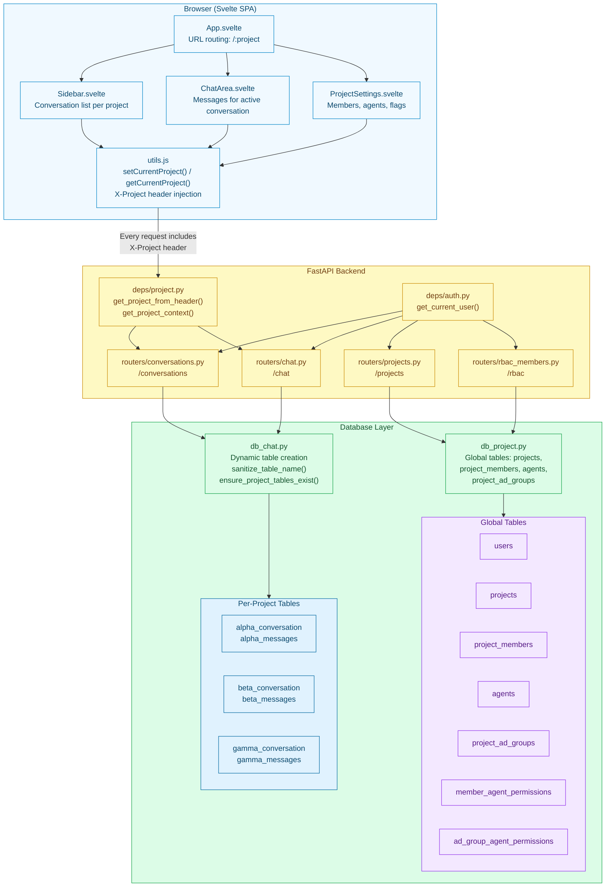
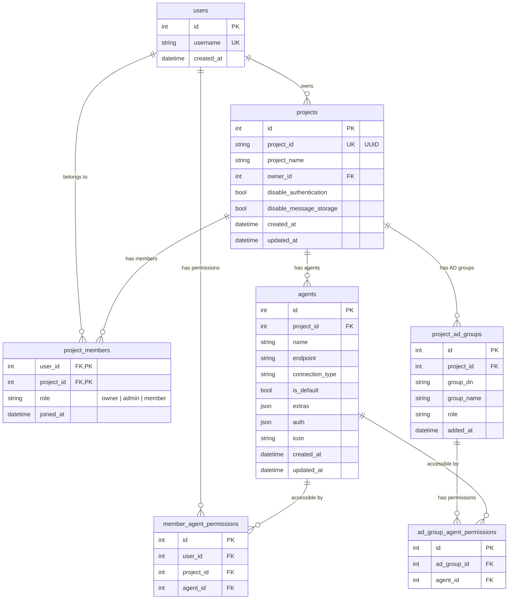
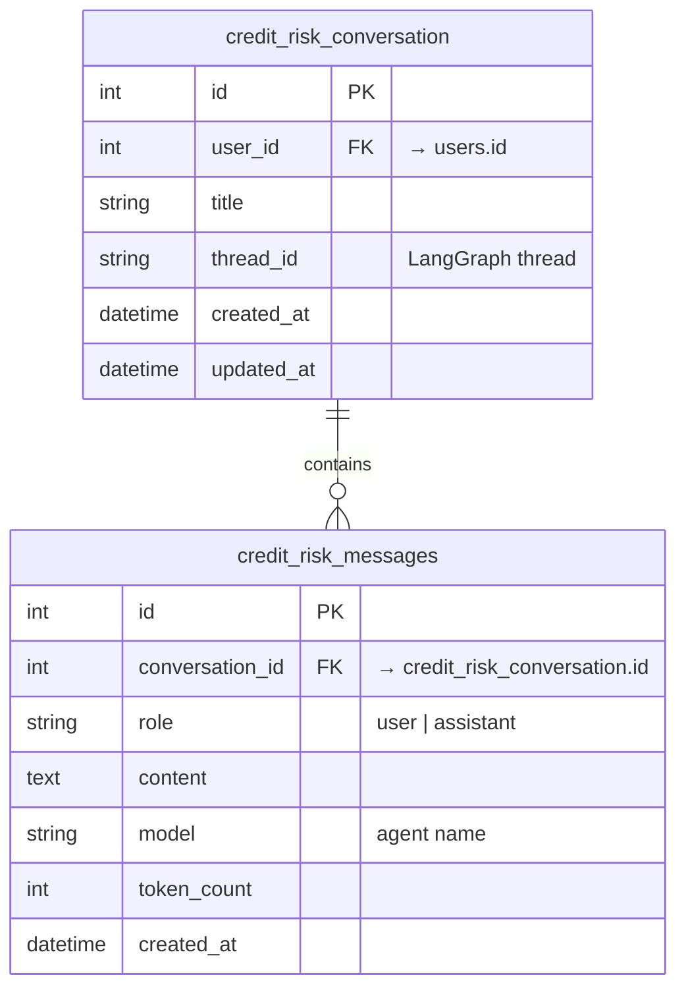
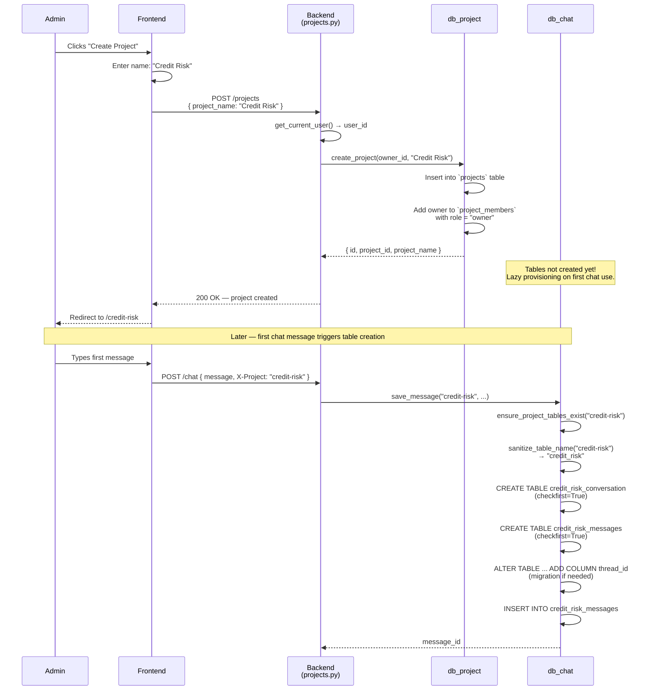
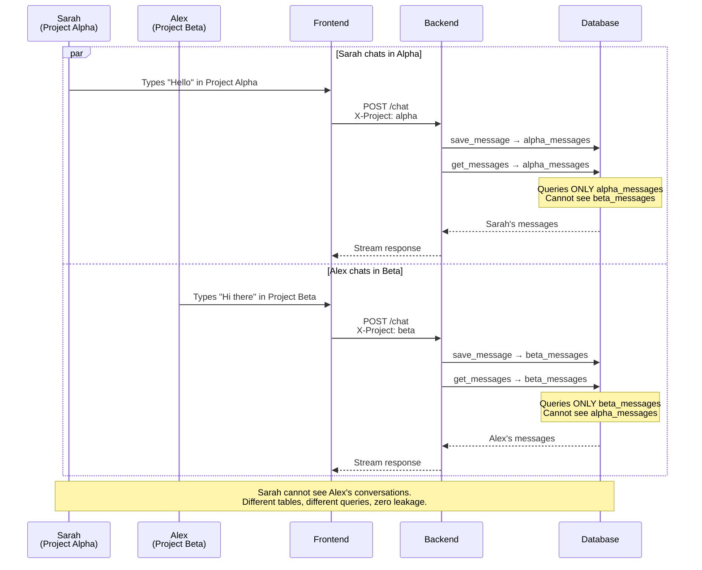
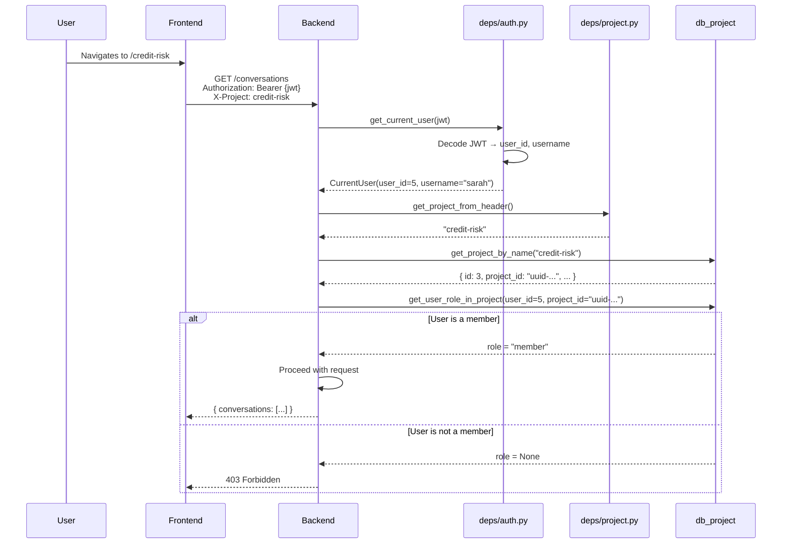
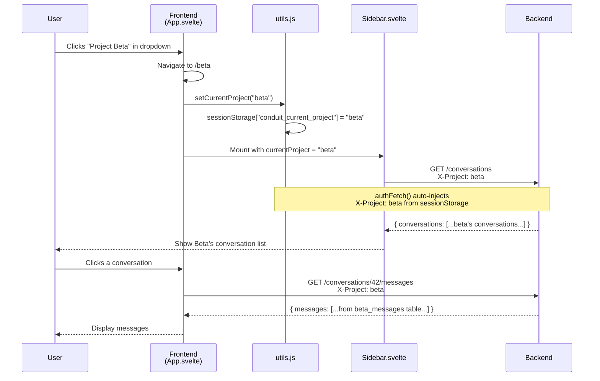
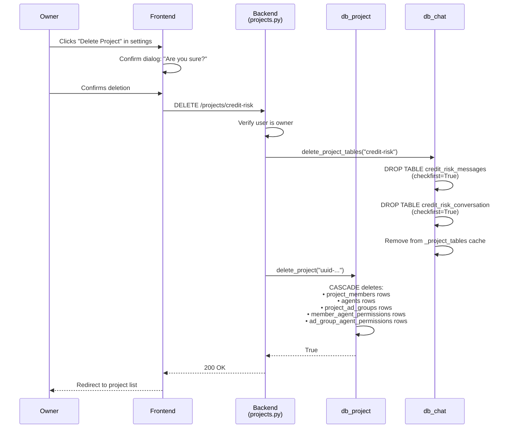
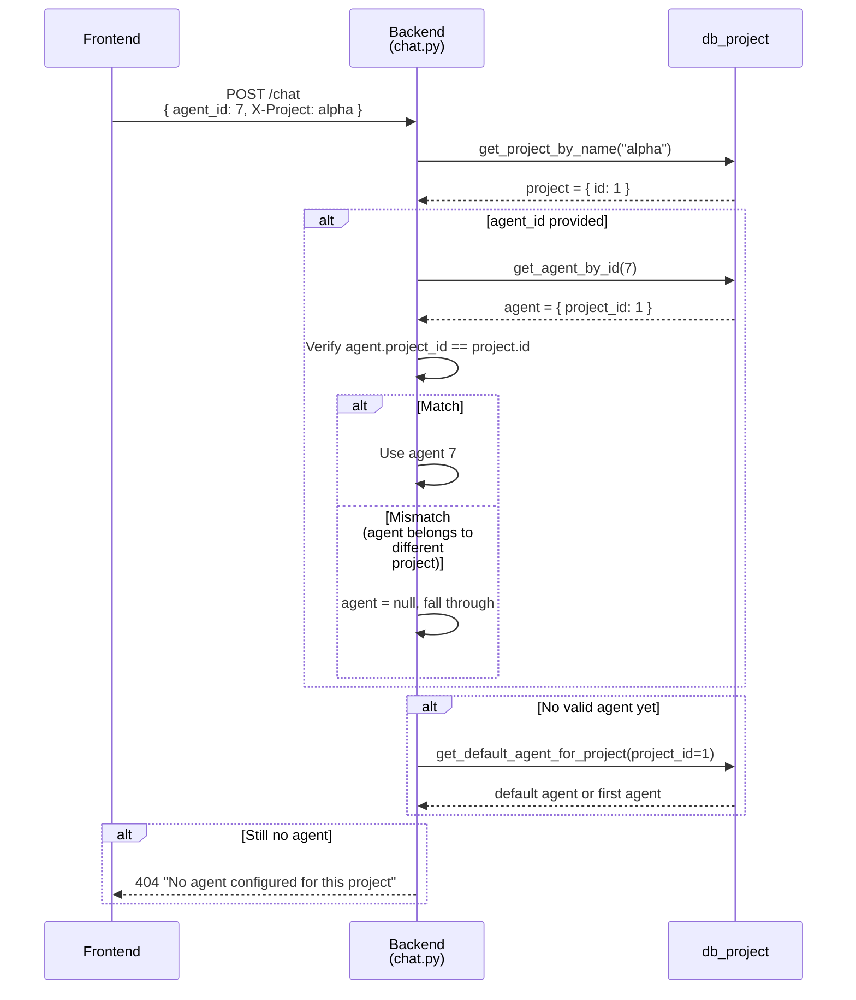

# Chat Segregation Feature — Architecture, Sequences & User Journey

## Table of Contents

1. [Feature Overview](#1-feature-overview)
2. [Architecture](#2-architecture)
3. [Data Model](#3-data-model)
4. [Isolation Mechanisms](#4-isolation-mechanisms)
5. [Sequence Diagrams](#5-sequence-diagrams)
6. [User Journey Map](#6-user-journey-map)
7. [Configuration & Flags](#7-configuration--flags)
8. [Design Decisions & Trade-offs](#8-design-decisions--trade-offs)

---

## 1. Feature Overview

Chat Segregation is Conduit's core multi-tenancy model. Every project receives **its own set of database tables** for conversations and messages, ensuring complete data isolation between teams, use cases, and business domains. Combined with RBAC (role-based access control), agent scoping, and project-level configuration flags, this forms the foundation on which all other features are built.

### Key Capabilities

- **Dynamic table creation**: When a project is first used for chat, `{project}_conversation` and `{project}_messages` tables are created automatically
- **Name sanitization**: Project names are normalized to valid SQL identifiers (lowercase, special characters replaced, max 63 chars)
- **RBAC enforcement**: Three roles (`owner`, `admin`, `member`) with per-project membership tracked in a global `project_members` association table
- **AD group access**: Enterprise LDAP/AD groups can be mapped to projects with role assignments
- **Agent scoping**: Each agent configuration is bound to exactly one project
- **Project header routing**: Every API request carries an `X-Project` header; the backend resolves all operations to the correct project-scoped tables
- **Per-project flags**: `disable_authentication` (guest access) and `disable_message_storage` (ephemeral chat) are configurable per project
- **Cascading deletion**: Deleting a project drops its conversation and message tables entirely
- **Usage isolation**: Token counts and metrics are tracked per project, per agent

### Why It Matters

Without chat segregation, a single shared conversation table would create data leakage risks, make RBAC enforcement complex, and limit scalability. By isolating at the database table level, Conduit achieves:

- **Zero cross-project data leakage** — queries physically cannot touch another project's tables
- **Independent scaling** — high-traffic projects don't contend with low-traffic ones at the table level
- **Simple cleanup** — deleting a project is a `DROP TABLE` with no orphan concerns
- **Regulatory compliance** — data residency and retention policies can differ per project

---

## 2. Architecture

### Component Diagram



### File Map

| Layer | File | Responsibility |
|-------|------|----------------|
| **Frontend** | `src/frontend/src/lib/utils.js` | Stores project name in `sessionStorage`, injects `X-Project` header on every `authFetch` |
| **Frontend** | `src/frontend/src/App.svelte` | URL routing — extracts project name from `/:project` path |
| **Frontend** | `src/frontend/src/lib/Sidebar.svelte` | Lists conversations scoped to current project via `GET /conversations` |
| **Frontend** | `src/frontend/src/lib/ProjectSettings.svelte` | Project admin UI — members, agents, flags |
| **Backend — Deps** | `src/api/deps/project.py` | `get_project_from_header()` extracts `X-Project`, `get_project_context()` handles auth bypass |
| **Backend — Deps** | `src/api/deps/auth.py` | JWT validation, `get_current_user()` dependency |
| **Backend — Router** | `src/api/routers/conversations.py` | CRUD for conversations scoped by project header |
| **Backend — Router** | `src/api/routers/chat.py` | Chat streaming scoped by project header |
| **Backend — Router** | `src/api/routers/projects.py` | Project CRUD, ownership checks |
| **Backend — Router** | `src/api/routers/rbac_members.py` | Member management with role assignment |
| **Core — DB** | `src/core/db/db_chat.py` | Dynamic table creation, `sanitize_table_name()`, per-project conversation/message CRUD |
| **Core — DB** | `src/core/db/db_project.py` | Global tables: `projects`, `project_members`, `agents`, `project_ad_groups`, RBAC queries |
| **Core — DB** | `src/core/db/db.py` | SQLAlchemy engine setup, supports SQLite and PostgreSQL |

---

## 3. Data Model

### Global Tables (shared across all projects)



### Per-Project Tables (created dynamically)

For a project named `"Credit Risk"`, the sanitized prefix is `credit_risk`:



### Table Name Sanitization

```
"My Project!"   → my_project__conversation, my_project__messages
"Credit Risk"   → credit_risk_conversation, credit_risk_messages
"123-test"      → _123_test_conversation, _123_test_messages
"a".repeat(100) → truncated to 63 chars
```

Rules applied by `sanitize_table_name()`:
1. Replace non-alphanumeric characters (except `_`) with `_`
2. Prepend `_` if name starts with a digit
3. Lowercase the entire name
4. Truncate to 63 characters (PostgreSQL identifier limit)

---

## 4. Isolation Mechanisms

### Layer 1: Network — `X-Project` Header

Every frontend request includes the current project name via the `X-Project` HTTP header. The backend extracts it in `get_project_from_header()` and passes it to all downstream operations.

```
Frontend: sessionStorage["conduit_current_project"] = "credit-risk"
           ↓
authFetch: headers["X-Project"] = "credit-risk"
           ↓
Backend:   get_project_from_header() → "credit-risk"
           ↓
db_chat:   ensure_project_tables_exist("credit-risk")
           → queries credit_risk_conversation / credit_risk_messages
```

### Layer 2: Database — Table-Per-Project

Each project's conversations and messages live in dedicated tables. There is no shared `conversations` table — the isolation is physical, not logical (no `WHERE project_id = ?` filter).

### Layer 3: Application — RBAC

Before any operation, the backend checks:
1. Is the user authenticated? (JWT validation)
2. Is the user a member of this project? (`project_members` lookup)
3. Does the user's role permit this action? (owner > admin > member)

| Action | Owner | Admin | Member |
|--------|:-----:|:-----:|:------:|
| Chat in project | Yes | Yes | Yes |
| Create conversations | Yes | Yes | Yes |
| View conversation list | Yes | Yes | Yes |
| Add/remove members | Yes | Yes | No |
| Configure agents | Yes | Yes | No |
| Update project settings | Yes | Yes | No |
| Delete project | Yes | No | No |

### Layer 4: Agent Scoping

Agents are bound to a `project_id` foreign key. When a chat request arrives, the backend resolves the agent:
1. Use `request.agent_id` if provided (validated against the project)
2. Fall back to the project's default agent
3. Fall back to agent name matching (deprecated `model` field)

An agent from Project A cannot be used in Project B.

### Layer 5: Optional Bypasses

| Flag | Effect |
|------|--------|
| `disable_authentication` | Project allows unauthenticated (guest) access. RBAC checks are skipped. |
| `disable_message_storage` | Messages are streamed but not persisted. Conversation metadata (title, timestamp) is still updated. |

---

## 5. Sequence Diagrams

### 5.1 Project Creation & Table Provisioning



### 5.2 Cross-Project Isolation During Chat



### 5.3 RBAC — Member Access Check



### 5.4 Project Switching in Frontend



### 5.5 Project Deletion — Cascading Cleanup



### 5.6 Agent Resolution Within Project Scope



---

## 6. User Journey Map

### Journey: Team Lead — Setting Up a New Project with Isolated Chat

**Persona**: Alex, an engineering manager, needs to create a dedicated AI workspace for his team. He wants data isolation from other teams, specific agents configured, and controlled membership.

### Journey Flowchart

```mermaid
flowchart TD
    %% ── Stage 1: Project Creation ──
    START([Alex logs into Conduit]) --> DASH[Dashboard — sees project list]
    DASH --> CREATE[Clicks 'Create Project']
    CREATE --> FORM[Enters project name:<br/>'Code Review Assistant']
    FORM --> FLAGS{Configure flags?}
    FLAGS -->|Yes| SET_FLAGS[Set disable_authentication<br/>and/or disable_message_storage]
    FLAGS -->|No| SUBMIT
    SET_FLAGS --> SUBMIT[Submit — POST /projects]
    SUBMIT --> CREATED[Project created in `projects` table<br/>Alex added as owner]

    %% ── Stage 2: Agent Configuration ──
    CREATED --> SETTINGS[Navigate to Project Settings]
    SETTINGS --> ADD_AGENT[Click 'Add Agent']
    ADD_AGENT --> AGENT_TYPE{Select agent type}
    AGENT_TYPE -->|LangGraph| LG_CONFIG[Enter LangGraph URL + graph_id]
    AGENT_TYPE -->|OpenAI| OAI_CONFIG[Enter OpenAI endpoint + API key]
    AGENT_TYPE -->|HTTP| HTTP_CONFIG[Enter custom endpoint]
    LG_CONFIG --> AUTH_CONFIG
    OAI_CONFIG --> AUTH_CONFIG
    HTTP_CONFIG --> AUTH_CONFIG
    AUTH_CONFIG[Configure auth<br/>bearer / basic / api_key]
    AUTH_CONFIG --> TEST_AGENT{Test agent?}
    TEST_AGENT -->|Yes| SEND_TEST[Send test message]
    SEND_TEST --> TEST_OK{Response OK?}
    TEST_OK -->|No| AUTH_CONFIG
    TEST_OK -->|Yes| SAVE_AGENT
    TEST_AGENT -->|Skip| SAVE_AGENT[Save agent + set as default]

    %% ── Stage 3: Team Membership ──
    SAVE_AGENT --> MEMBERS[Navigate to Members tab]
    MEMBERS --> ADD_MEMBER[Add team member by LAN ID]
    ADD_MEMBER --> ROLE{Assign role}
    ROLE -->|Admin| SET_ADMIN[Role: admin<br/>Can manage members + agents]
    ROLE -->|Member| SET_MEMBER[Role: member<br/>Chat only]
    SET_ADMIN --> MORE_MEMBERS
    SET_MEMBER --> MORE_MEMBERS
    MORE_MEMBERS{Add more members?}
    MORE_MEMBERS -->|Yes| ADD_MEMBER
    MORE_MEMBERS -->|No| AD_GROUP

    AD_GROUP{Add AD group access?}
    AD_GROUP -->|Yes| ADD_GROUP[Map AD group → project<br/>with role assignment]
    AD_GROUP -->|No| READY
    ADD_GROUP --> READY

    %% ── Stage 4: First Chat — Table Provisioning ──
    READY[Project ready — share with team]
    READY --> FIRST_CHAT[Team member opens project<br/>and sends first message]
    FIRST_CHAT --> PROVISION[db_chat creates<br/>code_review_assistant_conversation<br/>code_review_assistant_messages]
    PROVISION --> TABLES_LIVE[Tables live — chat data isolated]

    %% ── Stage 5: Daily Usage ──
    TABLES_LIVE --> DAILY[Team uses chat daily]
    DAILY --> ISOLATED[Each member sees only<br/>their own conversations]
    ISOLATED --> SWITCH{Switch to another project?}
    SWITCH -->|Yes| SWITCH_PROJ[Click project in sidebar<br/>→ X-Project header changes<br/>→ different tables queried]
    SWITCH_PROJ --> DAILY
    SWITCH -->|No| CONTINUE[Continue chatting]
    CONTINUE --> DAILY

    %% ── Stage 6: Monitoring & Maintenance ──
    DAILY --> MONITOR[Alex checks usage metrics]
    MONITOR --> USAGE[View per-agent stats:<br/>message count, tokens, active users]
    USAGE --> ADJUST{Adjustments needed?}
    ADJUST -->|Add agent| ADD_AGENT
    ADJUST -->|Change roles| MEMBERS
    ADJUST -->|Remove member| REMOVE[Remove member<br/>→ loses access immediately]
    ADJUST -->|Delete project| DELETE
    ADJUST -->|No| CONTINUE

    DELETE[Delete project<br/>→ DROP tables + cascade members/agents]
    DELETE --> END_SESSION([Project removed])

    %% ── Styling ──
    classDef stage1 fill:#e0f2fe,stroke:#0284c7,color:#0c4a6e
    classDef stage2 fill:#dcfce7,stroke:#16a34a,color:#14532d
    classDef stage3 fill:#fef9c3,stroke:#ca8a04,color:#713f12
    classDef stage4 fill:#fce7f3,stroke:#db2777,color:#831843
    classDef stage5 fill:#f3e8ff,stroke:#9333ea,color:#581c87
    classDef stage6 fill:#e0e7ff,stroke:#4f46e5,color:#312e81

    class START,DASH,CREATE,FORM,FLAGS,SET_FLAGS,SUBMIT,CREATED stage1
    class SETTINGS,ADD_AGENT,AGENT_TYPE,LG_CONFIG,OAI_CONFIG,HTTP_CONFIG,AUTH_CONFIG,TEST_AGENT,SEND_TEST,TEST_OK,SAVE_AGENT stage2
    class MEMBERS,ADD_MEMBER,ROLE,SET_ADMIN,SET_MEMBER,MORE_MEMBERS,AD_GROUP,ADD_GROUP,READY stage3
    class FIRST_CHAT,PROVISION,TABLES_LIVE stage4
    class DAILY,ISOLATED,SWITCH,SWITCH_PROJ,CONTINUE stage5
    class MONITOR,USAGE,ADJUST,REMOVE,DELETE,END_SESSION stage6
```



**Legend**: <span style="color:#0284c7">**Blue** = Project Creation</span> · <span style="color:#16a34a">**Green** = Agent Configuration</span> · <span style="color:#ca8a04">**Yellow** = Team Membership</span> · <span style="color:#db2777">**Pink** = Table Provisioning</span> · <span style="color:#9333ea">**Purple** = Daily Usage</span> · <span style="color:#4f46e5">**Indigo** = Monitoring & Maintenance</span>

---

### Stage Details

#### Stage 1: Project Creation

**User Goal**: Create an isolated workspace for the team

**Actions**:
- Logs in, navigates to dashboard
- Clicks "Create Project", enters name and optional flags
- Submits — project row created, Alex added as owner

**Touchpoints**: Dashboard, Create Project form

**Emotions**: Purposeful — Setting up infrastructure for the team

**Pain Points**:
- Project name constraints (sanitization rules) may not be obvious upfront
- No preview of what the sanitized table name will look like

**Opportunities**:
- Show sanitized name preview during creation
- Project templates with pre-configured agents

**Metrics**: Time from login to project creation, error rate on invalid names

---

#### Stage 2: Agent Configuration

**User Goal**: Connect an AI backend to the project

**Actions**:
- Opens project settings, adds agent with type/endpoint/auth
- Tests the connection, saves, marks as default

**Touchpoints**: Project Settings UI (agents tab)

**Emotions**: Technical focus — Must get credentials right

**Pain Points**:
- Invalid credentials produce generic errors
- No agent health check after initial setup

**Opportunities**:
- Connection test with detailed error diagnostics
- Periodic agent health monitoring

**Metrics**: Agent setup time, test-on-first-try success rate

---

#### Stage 3: Team Membership

**User Goal**: Grant team access with appropriate permissions

**Actions**:
- Adds members by LAN ID / username
- Assigns roles (admin for tech lead, member for developers)
- Optionally maps AD groups for bulk access

**Touchpoints**: Project Settings UI (members tab)

**Emotions**: Managerial — Organizing team structure

**Pain Points**:
- Adding members one-by-one is slow for large teams
- No bulk import

**Opportunities**:
- CSV bulk import for members
- AD group mapping eliminates individual adds

**Metrics**: Members added per session, time per member

---

#### Stage 4: Table Provisioning (First Chat)

**User Goal**: Start using the project for chat (implicit)

**Actions**:
- A team member sends the first message in the project
- Backend lazily creates `{project}_conversation` and `{project}_messages` tables

**Touchpoints**: Chat area (transparent to user)

**Emotions**: Neutral — User is unaware of table creation

**Pain Points**:
- First message may have slightly higher latency due to table creation
- No visibility into provisioning status

**Opportunities**:
- Pre-provision tables at project creation (trade-off: unused tables)
- Background provisioning triggered by project creation

**Metrics**: First-message latency, table creation success rate

---

#### Stage 5: Daily Usage

**User Goal**: Chat with AI within the project context

**Actions**:
- Team members open the project, see their conversations
- Chat with the configured agent, switch between conversations
- Switch to other projects — UI updates, different data shown

**Touchpoints**: Chat area, Sidebar, Model selector

**Emotions**: Productive — Focus on work, not infrastructure

**Pain Points**:
- No visual indicator showing which project is active if names are similar
- Conversation search within a project is not yet available

**Opportunities**:
- Project color coding or icons in the sidebar
- Full-text conversation search

**Metrics**: Daily active users per project, messages per session

---

#### Stage 6: Monitoring & Maintenance

**User Goal**: Ensure the project runs smoothly and costs are controlled

**Actions**:
- Reviews usage metrics (messages, tokens, active users per agent)
- Adjusts membership, adds/removes agents
- Optionally deletes the project (cascading cleanup)

**Touchpoints**: Project Settings, Usage Metrics

**Emotions**: Analytical / Decisive

**Pain Points**:
- No cost estimation from token counts
- Deletion is irreversible with no soft-delete

**Opportunities**:
- Cost calculator based on token usage and model pricing
- Soft-delete with recovery window
- Usage alerts / thresholds

**Metrics**: Projects deleted vs. active ratio, usage trend per project

---

### Journey Summary Table

| Stage | Actions | Emotions | Pain Points | Opportunities |
|-------|---------|----------|-------------|---------------|
| **Project Creation** | Name, flags, submit | Purposeful | Sanitization rules unclear | Name preview, templates |
| **Agent Config** | Type, endpoint, auth, test | Technical focus | Generic auth errors | Detailed diagnostics |
| **Team Membership** | Add members, assign roles | Managerial | One-by-one adds | Bulk import, AD groups |
| **Table Provisioning** | First message triggers DDL | Neutral (transparent) | Slight first-message latency | Pre-provisioning |
| **Daily Usage** | Chat, switch projects | Productive | No project visual cues | Color coding, search |
| **Monitoring** | Metrics, adjust, delete | Analytical | No cost estimation | Cost calculator, alerts |

---

## 7. Configuration & Flags

### Per-Project Flags

| Flag | Default | Effect |
|------|---------|--------|
| `disable_authentication` | `false` | When `true`, the project allows guest access. JWT validation is skipped. Useful for demo/public projects. |
| `disable_message_storage` | `false` | When `true`, messages are streamed to the user but not saved to the database. Conversation metadata (title, timestamps) is still maintained. Useful for sensitive/ephemeral workflows. |

### How `disable_message_storage` Works

```python
# In db_chat.save_message():
if disable_storage:
    # Still update conversation title and timestamp
    conversation.updated_at = datetime.utcnow()
    if not conversation.title and role == "user":
        conversation.title = content[:50]
    session.commit()
    return 0  # No message ID — nothing persisted
```

### Agent `extras` Fields Relevant to Segregation

| Key | Type | Description |
|-----|------|-------------|
| `graph_id` | string | LangGraph graph ID — scoped to the project's agent |
| `assistant_id` | string | LangGraph assistant ID — resolved within project context |
| `frontend` | boolean | Enables Dynamic UI panel (per-agent, within project scope) |

---

## 8. Design Decisions & Trade-offs

### Table-per-project vs. shared table with `project_id` column

**Chosen**: Table-per-project (dynamic DDL)

**Why**:
- Physical isolation — no risk of forgetting a `WHERE project_id = ?` filter
- Independent indexing — each project's tables have their own indexes sized to their data
- Clean deletion — `DROP TABLE` is simpler than `DELETE FROM ... WHERE project_id = ?`
- Regulatory — different projects can theoretically live in different databases

**Trade-off**:
- More tables in the database catalog (could be hundreds in large deployments)
- Dynamic DDL requires careful cache management (`_project_tables` registry)
- Schema migrations must iterate across all project tables (e.g., adding `thread_id` column)

### Lazy table creation vs. eager provisioning

**Chosen**: Lazy (on first `ensure_project_tables_exist` call)

**Why**: Avoids creating tables for projects that never use chat (e.g., projects created for testing, or projects that are configured before agents are ready).

**Trade-off**: First chat message pays the latency cost of `CREATE TABLE` + migration checks.

### `X-Project` header vs. URL path parameter

**Chosen**: Header (`X-Project`)

**Why**: Keeps API paths clean and REST-conventional (e.g., `/conversations` not `/projects/{name}/conversations`). The project is a cross-cutting context, similar to `Authorization`.

**Trade-off**: Less discoverable than URL parameters. Requires frontend discipline to always include the header.

### RBAC in application layer vs. database-level permissions

**Chosen**: Application layer (FastAPI dependencies + `project_members` table)

**Why**: Works identically across SQLite and PostgreSQL. No database-specific grants or row-level security policies to manage.

**Trade-off**: RBAC logic is enforced in Python, not at the database level. A direct database connection bypasses all access controls.

---

*See also: [Features & Capabilities](../prd/04-features.md) for the full feature catalog, [User Journeys](../prd/05-user-journeys.md) for other persona workflows, [Architecture](../prd/06-architecture.md) for system-wide design.*
