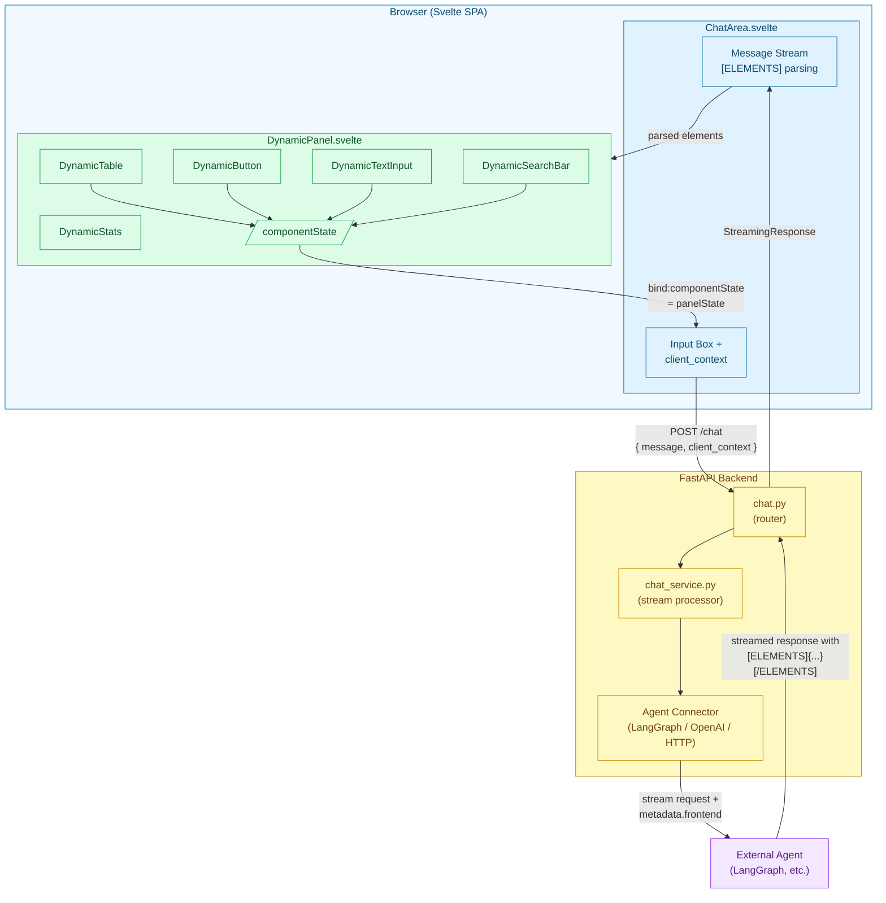
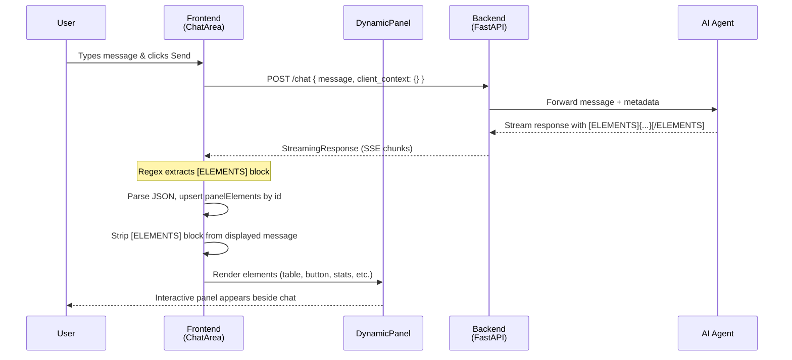
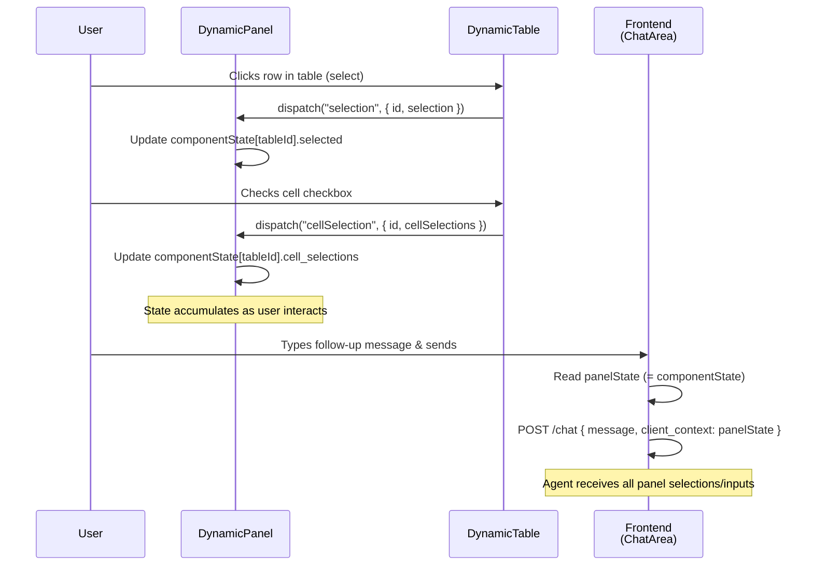
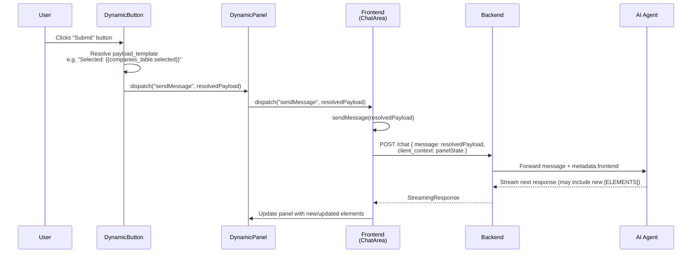
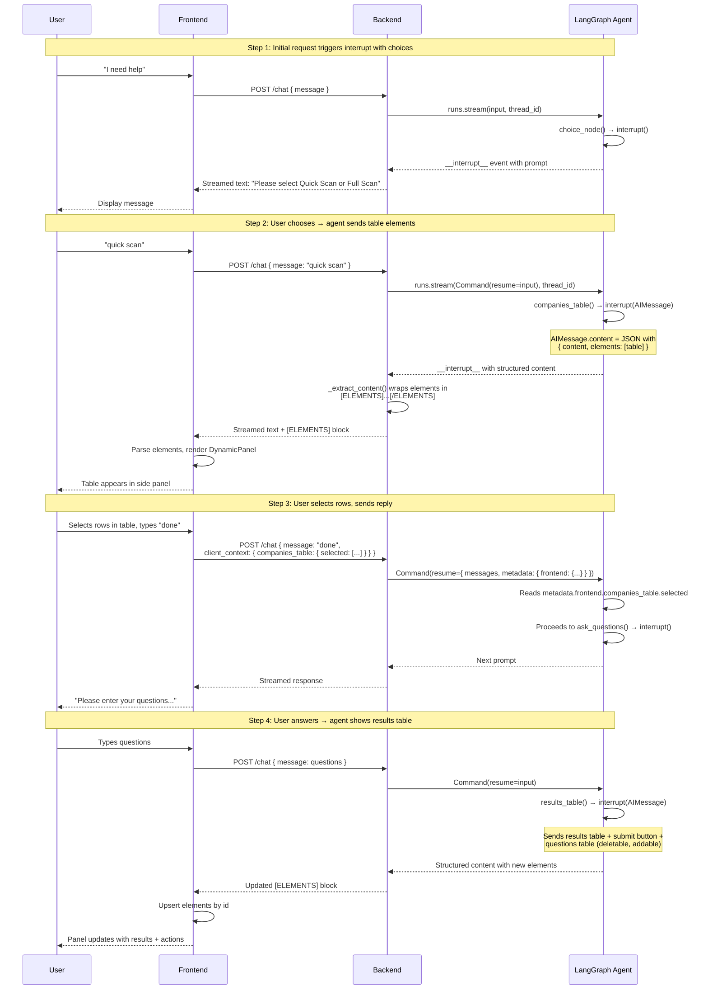
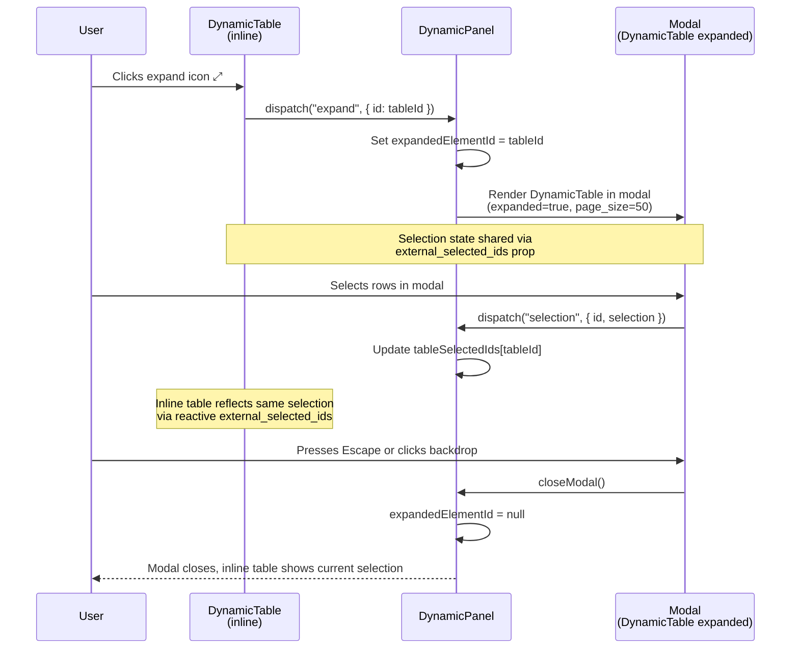
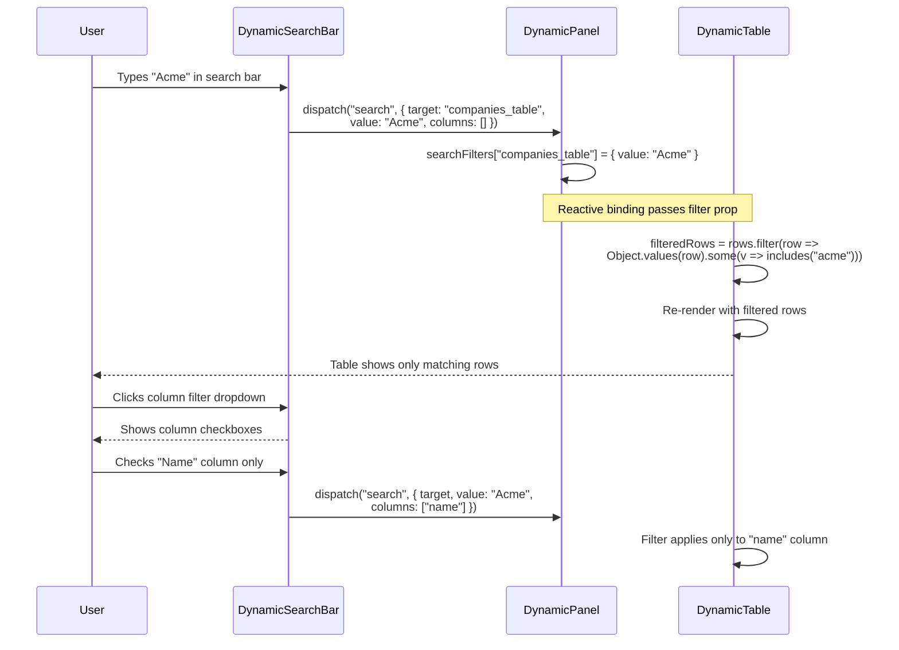

# Dynamic UI Feature — Architecture, Sequences & User Journey

## Table of Contents

1. [Feature Overview](#1-feature-overview)
2. [Architecture](#2-architecture)
3. [Supported Elements](#3-supported-elements)
4. [Data Flow & Protocols](#4-data-flow--protocols)
5. [Sequence Diagrams](#5-sequence-diagrams)
6. [User Journey Map](#6-user-journey-map)
7. [Agent Integration Guide](#7-agent-integration-guide)
8. [Design Decisions & Trade-offs](#8-design-decisions--trade-offs)

---

## 1. Feature Overview

The Dynamic UI system allows AI agents to programmatically render interactive UI components — tables, buttons, text inputs, search bars, and stat cards — in a **side panel** next to the chat area. User interactions with these components (selections, text input, button clicks) are captured as **client context** and sent back to the agent with the next message, enabling multi-step, form-driven workflows that go beyond simple text chat.

### Key Capabilities

- **Agent-driven rendering**: Agents embed `[ELEMENTS]...[/ELEMENTS]` blocks in their responses; the frontend parses and renders them
- **Bi-directional state**: User interactions are collected as `client_context` and included in every subsequent chat request
- **Upsert-by-ID semantics**: Elements with the same `id` are updated in-place; new `id`s append; sending `elements: []` clears the panel
- **Modal expansion**: Tables can be expanded to a full-screen modal while keeping selection state in sync
- **Template-based actions**: Buttons resolve `{{context.path}}` templates to inject live panel state into messages
- **Configurable layout**: Agents control panel ratio (`panel_ratio`), sidebar collapse (`collapse_sidebar`), and panel visibility (`frontend`)

### Design Philosophy

The Dynamic UI transforms Conduit from a simple chat interface into a **conversational application platform**. Instead of agents returning only text, they can present structured data, collect user decisions, and drive multi-step workflows — all without building a custom frontend.

---

## 2. Architecture

### Component Overview



### File Map

| Layer | File | Responsibility |
|-------|------|----------------|
| **Frontend — Orchestrator** | `src/frontend/src/lib/ChatArea.svelte` | Parses `[ELEMENTS]` blocks from streamed responses, manages `panelElements` and `panelState`, sends `client_context` |
| **Frontend — Panel** | `src/frontend/src/lib/DynamicPanel.svelte` | Renders elements by type, manages `componentState`, handles events (selection, input, search, add, delete, expand) |
| **Frontend — Table** | `src/frontend/src/lib/dynamic/DynamicTable.svelte` | Data grid with sorting, pagination, search, row/cell selection, add/delete, modal expand |
| **Frontend — Button** | `src/frontend/src/lib/dynamic/DynamicButton.svelte` | Resolves `{{path}}` templates against `componentState`, dispatches `sendMessage` |
| **Frontend — Text Input** | `src/frontend/src/lib/dynamic/DynamicTextInput.svelte` | Single-line or multiline text input, value stored in panel state |
| **Frontend — Search Bar** | `src/frontend/src/lib/dynamic/DynamicSearchBar.svelte` | Text filter targeting a specific table by `target` id, column filter dropdown |
| **Frontend — Stats** | `src/frontend/src/lib/dynamic/DynamicStats.svelte` | Grafana-style stat cards with value, label, unit, color, trend (read-only) |
| **Backend — Router** | `src/api/routers/chat.py` | Accepts `ChatRequest` with `client_context`, creates `StreamingResponse` |
| **Backend — Service** | `src/api/services/chat_service.py` | Merges `client_context` into `metadata.frontend`, passes to connector |
| **Backend — Schema** | `src/api/schema.py` | `ChatRequest` model with `client_context: Optional[Dict[str, Any]]` |
| **Backend — Connector** | `src/core/agent/connectors/langgraph_connector.py` | Extracts `elements` from structured responses, wraps in `[ELEMENTS]...[/ELEMENTS]` |

---

## 3. Supported Elements

| Element | Interactive | State in `client_context` | Key Properties |
|---------|:-----------:|---------------------------|----------------|
| **button** | Yes | Triggers `send_message` with template | `label`, `variant`, `action`, `payload_template` |
| **text_input** | Yes | `{ value: "..." }` | `label`, `placeholder`, `required`, `multiline` |
| **search_bar** | Yes | Filters target table (not in context) | `target`, `placeholder` |
| **table** | Yes | `{ selected: [...] }`, `cell_selections`, `added`, `deleted` | `columns`, `rows`, `select_mode`, `searchable`, `sortable`, `deletable`, `addable`, `page_size` |
| **stats** | No | None (read-only) | `stats[]` with `label`, `value`, `unit`, `color`, `trend` |

### Element Lifecycle

1. **Creation**: Agent sends `[ELEMENTS]{"elements": [...]}[/ELEMENTS]` in response content
2. **Upsert**: Matched by `id` — existing elements are replaced, new ones appended
3. **User interaction**: Changes are stored in `componentState` within `DynamicPanel`
4. **State feedback**: On next message (or button click), `componentState` is sent as `client_context`
5. **Update**: Agent reads `client_context`, sends updated elements in the next response
6. **Clear**: Agent sends `{"elements": []}` to remove all panel elements

---

## 4. Data Flow & Protocols

### Wire Format: Agent → Frontend

Elements are embedded in the assistant message content as a tagged block:

```
Here are your results:
[ELEMENTS]{"elements": [{"type": "table", "id": "t1", ...}]}[/ELEMENTS]
```

The frontend regex `\[ELEMENTS\]([\s\S]*?)\[\/ELEMENTS\]` extracts the JSON payload. The `[ELEMENTS]` block is stripped from the displayed message.

### Wire Format: Frontend → Backend

```json
POST /chat
{
  "message": "user text or button payload",
  "conversation_id": 42,
  "agent_id": 7,
  "client_context": {
    "companies_table": {
      "selected": [
        { "id": 1, "name": "Acme" },
        { "id": 2, "name": "Globex" }
      ]
    },
    "username_input": {
      "value": "john_doe"
    },
    "results_table": {
      "cell_selections": {
        "1": { "disagree": true, "shortlist": false }
      }
    }
  }
}
```

### Wire Format: Backend → Agent

The backend merges `client_context` into the metadata object sent to the agent connector:

```json
{
  "metadata": {
    "user": { "user_id": "5", "username": "sarah", "ad_group": [] },
    "conversation": { "conversation_id": "42" },
    "project": "my-project",
    "frontend": {
      "companies_table": { "selected": [...] },
      "username_input": { "value": "john_doe" }
    }
  }
}
```

For LangGraph agents, this is available via `interrupt()` resume data under `metadata.frontend`.

### Button Template Resolution

When a button with `action: "send_message"` is clicked, the `payload_template` is resolved against the current `componentState`:

```
payload_template: "Selected: {{companies_table.selected}}"
→ resolves to: "Selected: [{"id":1,"name":"Acme"},{"id":2,"name":"Globex"}]"
```

The resolved string is sent as the message content in the next `POST /chat` request.

---

## 5. Sequence Diagrams

### 5.1 Basic Dynamic UI Flow (Agent Sends Elements)



### 5.2 User Interacts with Panel Elements



### 5.3 Button Click → Message Dispatch



### 5.4 LangGraph Interrupt-Driven Multi-Step Workflow



### 5.5 Table Expand to Modal



### 5.6 Search Bar → Table Filtering



---

## 6. User Journey Map

### Journey: Data Analyst — Interactive Report Workflow

**Persona**: Dana, a credit risk analyst, uses Conduit to generate periodic company screening reports. The agent guides her through a multi-step process: selecting companies, asking screening questions, reviewing results, and exporting a report.

### Journey Flowchart

```mermaid
flowchart TD
    %% ── Stage 1: Initiation ──
    START([Dana opens Conduit]) --> AUTH{Authenticated?}
    AUTH -->|No| LOGIN[Login with credentials / LDAP]
    LOGIN --> TOKEN[JWT token issued]
    TOKEN --> DASH
    AUTH -->|Yes| DASH[Dashboard]
    DASH --> PROJ[Select 'Credit Risk' project]
    PROJ --> AGENT[Pick screening agent from Model Selector]
    AGENT --> SAMPLE{Use sample question?}
    SAMPLE -->|Yes| CLICK_SAMPLE[Click suggested prompt]
    SAMPLE -->|No| TYPE_START[Type 'Start a new screening']
    CLICK_SAMPLE --> SEND1[Send message to agent]
    TYPE_START --> SEND1

    %% ── Stage 2: Company Selection ──
    SEND1 --> AGENT_TABLE[Agent streams response with<br/>ELEMENTS: companies table]
    AGENT_TABLE --> PANEL_RENDER[Dynamic Panel renders<br/>searchable table + button]
    PANEL_RENDER --> SEARCH{Need to filter?}
    SEARCH -->|Yes| USE_SEARCH[Type in search bar /<br/>apply column filters]
    USE_SEARCH --> SELECT_ROWS
    SEARCH -->|No| SELECT_ROWS[Select companies<br/>via checkboxes]
    SELECT_ROWS --> LARGE{Too many rows?}
    LARGE -->|Yes| EXPAND[Expand table to modal<br/>50 rows per page]
    EXPAND --> SELECT_MORE[Continue selecting in modal]
    SELECT_MORE --> CLOSE_MODAL[Close modal]
    CLOSE_MODAL --> SUBMIT_CO
    LARGE -->|No| SUBMIT_CO[Click 'Submit' button /<br/>type 'done']

    %% ── Stage 3: Question Input ──
    SUBMIT_CO --> SEND2[Send selection + client_context<br/>to agent]
    SEND2 --> AGENT_Q[Agent reads selected companies<br/>from metadata.frontend]
    AGENT_Q --> PROMPT_Q[Agent prompts:<br/>'Enter your screening questions']
    PROMPT_Q --> INPUT_Q{Input method?}
    INPUT_Q -->|Chat| TYPE_Q[Type questions in chat input]
    INPUT_Q -->|Panel| TEXT_INPUT[Use text_input element<br/>in Dynamic Panel]
    TYPE_Q --> SEND3[Send questions to agent]
    TEXT_INPUT --> SEND3

    %% ── Stage 4: Results Review ──
    SEND3 --> AGENT_RES[Agent generates results]
    AGENT_RES --> RES_PANEL[Panel renders:<br/>• Results table with selectable columns<br/>• Questions table deletable + addable<br/>• Submit button<br/>• PDF file download]
    RES_PANEL --> REVIEW[Review results row by row]
    REVIEW --> CELL_SELECT[Check 'I Disagree' /<br/>'Shortlist' per row]
    CELL_SELECT --> EDIT_Q{Edit questions?}
    EDIT_Q -->|Add| ADD_Q[Add new question via<br/>inline form]
    EDIT_Q -->|Delete| DEL_Q[Remove question row]
    EDIT_Q -->|No| DOWNLOAD
    ADD_Q --> DOWNLOAD
    DEL_Q --> DOWNLOAD
    DOWNLOAD --> DL_PDF{Download report?}
    DL_PDF -->|Yes| CLICK_DL[Click PDF download link]
    DL_PDF -->|No| DECIDE

    CLICK_DL --> DECIDE

    %% ── Stage 5: Iteration ──
    DECIDE{Next action?}
    DECIDE -->|Ask more questions| SEND2
    DECIDE -->|Select more companies| SEND1
    DECIDE -->|Generate full report| FULL_SCAN[Agent runs full scan<br/>with all accumulated state]
    DECIDE -->|End| END_SESSION

    %% ── Stage 6: Export & Completion ──
    FULL_SCAN --> FINAL_REPORT[Agent sends final PDF via<br/>FILE block + summary message]
    FINAL_REPORT --> CLEAR_PANEL[Agent sends elements: empty<br/>to clear Dynamic Panel]
    CLEAR_PANEL --> END_SESSION

    END_SESSION([Session complete])

    %% ── Styling ──
    classDef stage1 fill:#e0f2fe,stroke:#0284c7,color:#0c4a6e
    classDef stage2 fill:#dcfce7,stroke:#16a34a,color:#14532d
    classDef stage3 fill:#fef9c3,stroke:#ca8a04,color:#713f12
    classDef stage4 fill:#fce7f3,stroke:#db2777,color:#831843
    classDef stage5 fill:#f3e8ff,stroke:#9333ea,color:#581c87
    classDef stage6 fill:#e0e7ff,stroke:#4f46e5,color:#312e81

    class START,AUTH,LOGIN,TOKEN,DASH,PROJ,AGENT,SAMPLE,CLICK_SAMPLE,TYPE_START,SEND1 stage1
    class AGENT_TABLE,PANEL_RENDER,SEARCH,USE_SEARCH,SELECT_ROWS,LARGE,EXPAND,SELECT_MORE,CLOSE_MODAL,SUBMIT_CO stage2
    class SEND2,AGENT_Q,PROMPT_Q,INPUT_Q,TYPE_Q,TEXT_INPUT,SEND3 stage3
    class AGENT_RES,RES_PANEL,REVIEW,CELL_SELECT,EDIT_Q,ADD_Q,DEL_Q,DOWNLOAD,DL_PDF,CLICK_DL stage4
    class DECIDE stage5
    class FULL_SCAN,FINAL_REPORT,CLEAR_PANEL,END_SESSION stage6
```



**Legend**: Each color represents a journey stage — <span style="color:#0284c7">**blue** = Initiation</span> · <span style="color:#16a34a">**green** = Company Selection</span> · <span style="color:#ca8a04">**yellow** = Question Input</span> · <span style="color:#db2777">**pink** = Results Review</span> · <span style="color:#9333ea">**purple** = Iteration</span> · <span style="color:#4f46e5">**indigo** = Export & Completion</span>

---

#### Stage 1: Initiation

**User Goal**: Start a new screening session

**Actions**:
- Opens Conduit, selects "Credit Risk" project
- Picks the screening agent from the model selector
- Types "Start a new screening"

**Touchpoints**: Chat interface, Model selector

**Emotions**: Neutral — Routine task, familiar interface

**Pain Points**:
- Must remember which agent to select if multiple are configured

**Opportunities**:
- Sample questions (configured in agent `extras.sample_questions`) provide one-click workflow starters

**Metrics**: Time from login to first agent response

---

#### Stage 2: Company Selection

**User Goal**: Choose which companies to screen

**Actions**:
- Agent presents a searchable table of companies in the side panel
- Dana uses the search bar to filter companies by name
- Selects multiple companies using checkboxes
- Types "done" or clicks a "Submit" button

**Touchpoints**: Dynamic Panel (table + search bar + button), Chat area

**Emotions**: Engaged — The table is faster than listing companies in chat text

**Pain Points**:
- Large datasets may require pagination; users must check multiple pages
- No "select all matching filter" shortcut

**Opportunities**:
- Expand-to-modal for large tables improves visibility
- Column sort helps find companies quickly
- Search bar with column filter narrows results precisely

**Metrics**: Time to complete selection, number of page navigations

---

#### Stage 3: Question Input

**User Goal**: Define the screening questions

**Actions**:
- Agent prompts "Enter your screening questions"
- Dana types questions directly in the chat input
- Alternatively, the agent shows a text_input element for structured input
- Dana submits her questions

**Touchpoints**: Chat input, Dynamic Panel (optional text_input)

**Emotions**: Focused — Crafting good questions requires thought

**Pain Points**:
- Multi-line questions in chat input can feel cramped
- No way to save/reuse question templates

**Opportunities**:
- Agent could suggest pre-built question sets
- Multiline text_input with clear labeling improves the experience

**Metrics**: Number of questions submitted, time spent composing

---

#### Stage 4: Results Review

**User Goal**: Review screening results and flag disagreements

**Actions**:
- Agent sends a results table with `selectable` columns ("I Disagree", "Shortlist")
- Dana reviews each row, checking disagreement or shortlist boxes
- Uses the expand button to view the full table in a modal
- Optionally adds or deletes rows (if `addable`/`deletable` enabled)
- Agent simultaneously provides a file download link (PDF report)

**Touchpoints**: Dynamic Panel (table with cell selections + button), Modal view, File download

**Emotions**: Satisfied (if results are relevant) / Frustrated (if noisy results)

**Pain Points**:
- Many columns may cause horizontal scroll
- Cell-level selections across many rows can be tedious

**Opportunities**:
- Column sorting by risk level helps prioritize review
- Expandable modal with 50 rows per page speeds up bulk review
- Inline "I Disagree" checkboxes capture feedback without typing

**Metrics**: Time spent in review, number of disagreements flagged, report download rate

---

#### Stage 5: Iteration

**User Goal**: Refine the analysis or proceed to export

**Actions**:
- Dana types "ask more questions" to refine, "select more companies" to go back, or "generate full report" to finalize
- The agent loops back to the appropriate step, preserving all prior state
- Questions table is shown with `deletable: true` and `addable: true` for editing
- A "Submit" button sends the finalized question list

**Touchpoints**: Chat input, Dynamic Panel (editable questions table + button)

**Emotions**: Empowered — Full control over the iterative process

**Pain Points**:
- Remembering command words ("ask more questions" vs free text) can be confusing
- Long iteration loops may lose track of what was already done

**Opportunities**:
- Buttons for each action eliminate the need to remember commands
- Agent could summarize progress at each iteration point

**Metrics**: Number of iterations before export, time per iteration cycle

---

#### Stage 6: Export & Completion

**User Goal**: Download the final report and end the session

**Actions**:
- Agent generates a PDF report and sends it via `[FILE]...[/FILE]` block
- Dana clicks the download link in the chat
- Agent sends `{"elements": []}` to clear the panel
- Dana starts a new conversation or logs out

**Touchpoints**: Chat area (file download), Dynamic Panel (cleared)

**Emotions**: Relieved / Accomplished — Task complete

**Pain Points**:
- Large file downloads may take time
- No confirmation that the report captured all selections

**Opportunities**:
- Summary message before download listing all selections and questions
- Stats panel showing screening coverage metrics

**Metrics**: Report download rate, session duration, task completion rate

---

### Journey Summary Table

| Stage | Actions | Emotions | Pain Points | Opportunities |
|-------|---------|----------|-------------|---------------|
| **Initiation** | Select agent, type start | Neutral | Agent selection | Sample questions |
| **Company Selection** | Search, filter, select rows | Engaged | Pagination for large data | Modal expand, column sort |
| **Question Input** | Type or use text_input | Focused | Cramped input | Question templates |
| **Results Review** | Review table, flag cells, download | Satisfied/Frustrated | Horizontal scroll, tedious cells | Sortable columns, modal view |
| **Iteration** | Refine via commands or buttons | Empowered | Remembering commands | Action buttons, progress summary |
| **Export** | Download report, clear panel | Accomplished | No confirmation | Summary + stats panel |

---

## 7. Agent Integration Guide

### Sending Elements from Your Agent

#### Simple Example (any connector)

Include the `[ELEMENTS]` block directly in your response text:

```python
response = "Here are the results:\n"
response += "[ELEMENTS]" + json.dumps({
    "elements": [
        {
            "type": "table",
            "id": "results",
            "title": "Search Results",
            "columns": [
                {"key": "name", "label": "Name", "sortable": True},
                {"key": "score", "label": "Score", "sortable": True}
            ],
            "rows": [
                {"id": 1, "name": "Result A", "score": 95},
                {"id": 2, "name": "Result B", "score": 87}
            ],
            "select_mode": "single",
            "searchable": True
        }
    ]
}) + "[/ELEMENTS]"
yield response
```

#### LangGraph Example (interrupt-driven)

For LangGraph agents, return structured JSON as the interrupt content. The `LangGraphConnector._extract_content()` method automatically wraps `elements` in `[ELEMENTS]` tags:

```python
from langgraph.types import interrupt
from langchain_core.messages import AIMessage
import json

def my_node(state):
    content = json.dumps({
        "content": "Please select a company:",
        "elements": [
            {
                "type": "table",
                "id": "companies",
                "columns": [{"key": "name", "label": "Company"}],
                "rows": [
                    {"id": 1, "name": "Acme Corp"},
                    {"id": 2, "name": "Globex Inc"}
                ],
                "select_mode": "single"
            }
        ]
    })
    choice = interrupt(AIMessage(content=content))
    # Read user selection from frontend context
    frontend = choice.get("metadata", {}).get("frontend", {})
    selected = frontend.get("companies", {}).get("selected")
    return {"selected_company": selected}
```

### Reading `client_context` in Your Agent

The frontend state is available at `metadata.frontend` (for LangGraph, inside the interrupt resume data):

```python
# LangGraph interrupt resume
resume_data = interrupt(...)
frontend = resume_data.get("metadata", {}).get("frontend", {})

# Table selections
selected_rows = frontend.get("my_table", {}).get("selected", [])
cell_selections = frontend.get("my_table", {}).get("cell_selections", {})
added_rows = frontend.get("my_table", {}).get("added", [])
deleted_rows = frontend.get("my_table", {}).get("deleted", [])

# Text input values
username = frontend.get("username_input", {}).get("value", "")
```

### Agent Configuration (extras)

Configure Dynamic UI behavior in the agent's `extras` JSON:

```json
{
  "frontend": true,
  "collapse_sidebar": true,
  "panel_ratio": "1:2",
  "sample_questions": [
    { "title": "Quick Scan", "description": "Run a quick company screening" },
    { "title": "Full Report", "description": "Generate a comprehensive report" }
  ]
}
```

| Key | Type | Description |
|-----|------|-------------|
| `frontend` | boolean | Enables the Dynamic UI panel for this agent |
| `collapse_sidebar` | boolean | Auto-collapses the conversation sidebar when the panel first appears |
| `panel_ratio` | string | Flex ratio between chat and panel (e.g. `"1:2"` gives panel 2x width) |
| `sample_questions` | array | Suggested starter prompts shown on empty chat screen |

---

## 8. Design Decisions & Trade-offs

### In-band signaling (`[ELEMENTS]` tags in message content)

**Why**: Keeps the streaming response simple — no separate WebSocket channel or structured SSE event types needed. The agent just outputs text. The tags are stripped before display.

**Trade-off**: Parsing happens after full streaming completes. Elements are not rendered incrementally during streaming — they appear once the response finishes.

### Upsert-by-ID (not replace-all)

**Why**: Allows agents to update a single element without re-sending the entire panel. Multiple response rounds can build up a complex panel incrementally.

**Trade-off**: Agents must manage element IDs carefully. Stale elements persist until explicitly cleared with `{"elements": []}`.

### `client_context` sent on every message

**Why**: Stateless backend — the backend doesn't track panel state. The frontend is the source of truth for all interactive state.

**Trade-off**: Payload size grows with panel complexity. Very large tables with many selected rows could increase request size.

### Template resolution in the browser

**Why**: Buttons need to reference the live panel state at click time. Resolving `{{path}}` templates client-side avoids a round-trip.

**Trade-off**: Template syntax is limited to simple dot-path traversal. No conditionals, loops, or formatting functions.

---

*See also: [Supported Elements User Guide](../user-guide/supported-elements-user-guide.md) for element property reference, [LangGraph Connector Guide](../user-guide/langgraph-connector-user-guide.md) for connector details.*
