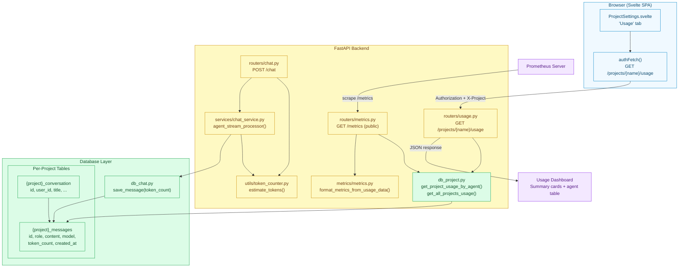
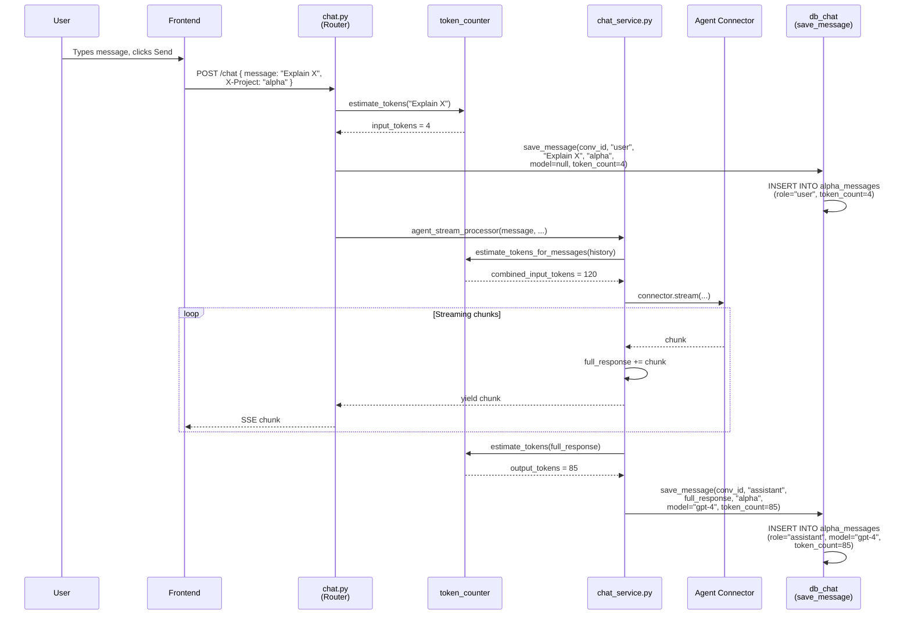
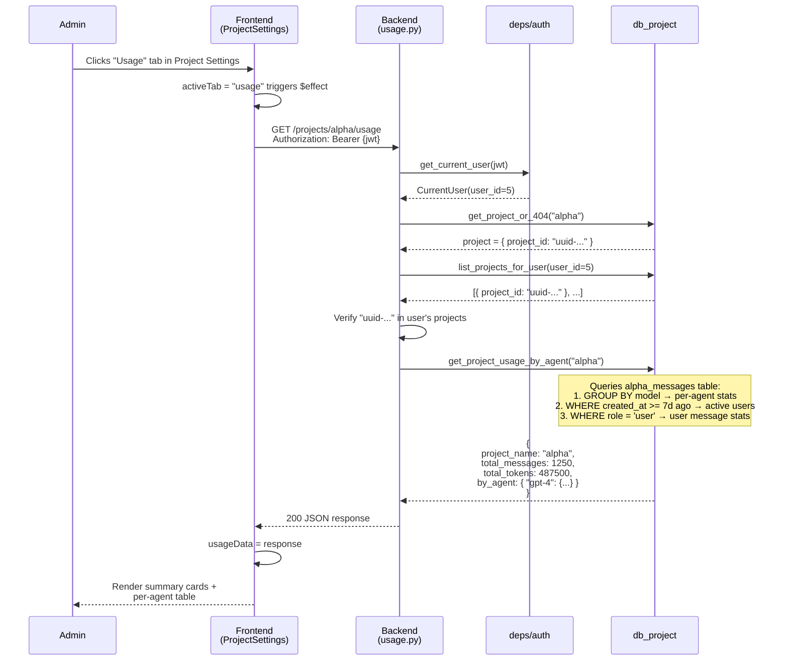
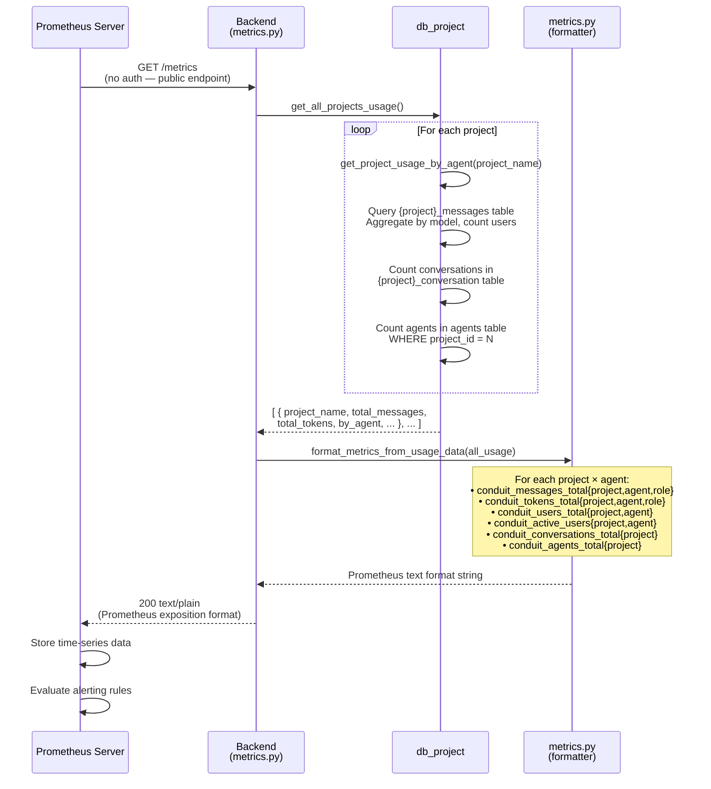
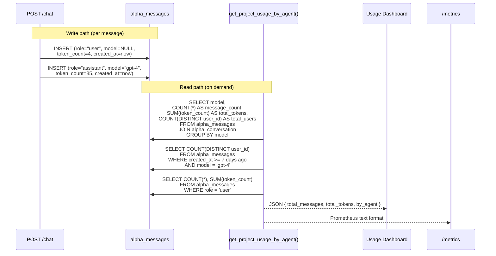
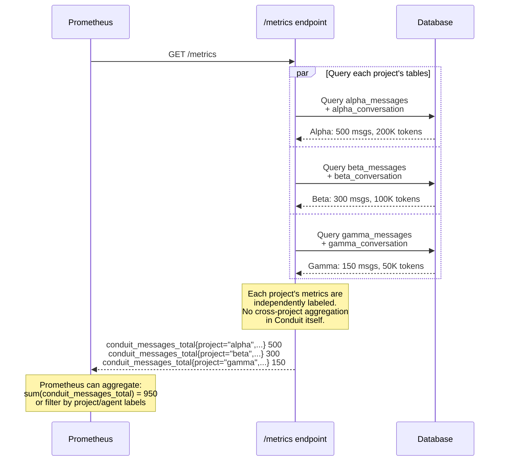
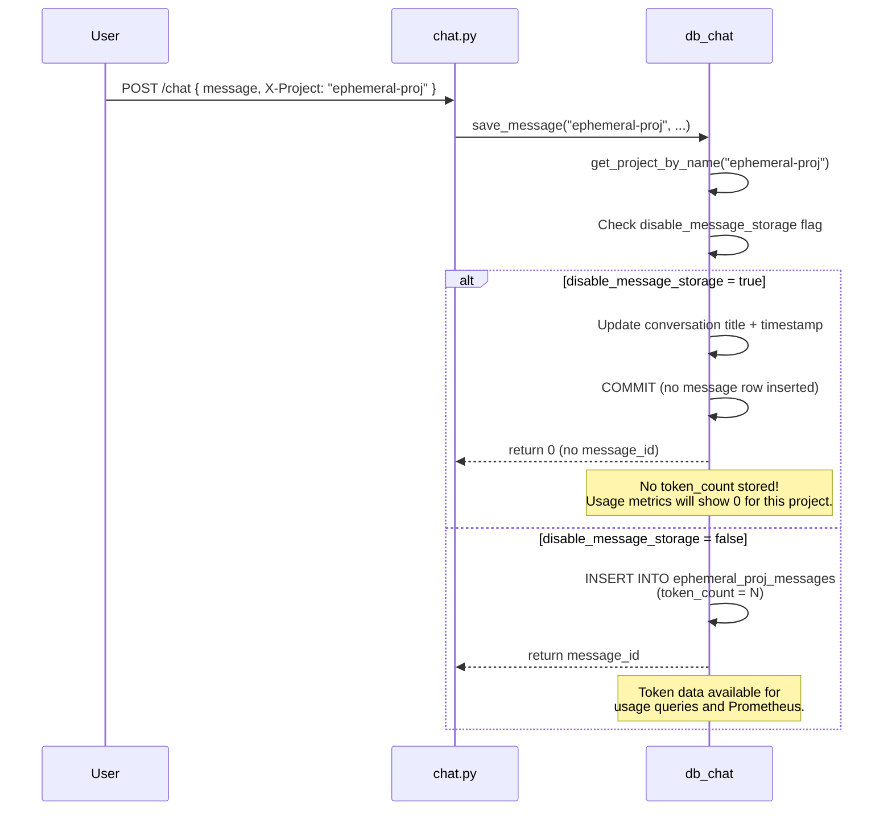

# Metrics Tracking Feature — Architecture, Sequences & User Journey

## Table of Contents

1. [Feature Overview](#1-feature-overview)
2. [Architecture](#2-architecture)
3. [Data Collection Pipeline](#3-data-collection-pipeline)
4. [Metrics Catalog](#4-metrics-catalog)
5. [Sequence Diagrams](#5-sequence-diagrams)
6. [User Journey Map](#6-user-journey-map)
7. [Prometheus Integration](#7-prometheus-integration)
8. [Design Decisions & Trade-offs](#8-design-decisions--trade-offs)

---

## 1. Feature Overview

Conduit tracks usage metrics at the message level and aggregates them per project, per agent, and per user. These metrics serve two audiences: **project admins** who view usage via the Project Settings UI, and **platform operators** who scrape a Prometheus-compatible `/metrics` endpoint for infrastructure monitoring.

### Key Capabilities

- **Token estimation**: Every message (user and assistant) is measured using a word/character-based token estimator before storage
- **Per-message persistence**: Token counts are stored in the `token_count` column of each project's `{project}_messages` table
- **Per-agent aggregation**: Usage is grouped by agent name, producing message counts, token totals, total users, and 7-day active users
- **Project-level rollup**: Total messages, total tokens, conversation count, and agent count per project
- **Prometheus export**: `/metrics` endpoint formats all project usage into standard Prometheus counter/gauge metrics with project and agent labels
- **Frontend dashboard**: Project Settings "Usage" tab shows summary cards and a per-agent breakdown table
- **Access control**: The usage API requires authentication and verifies project membership

### Metric Dimensions

| Dimension | Source | Description |
|-----------|--------|-------------|
| **Project** | `X-Project` header → `{project}_messages` table | Every metric is scoped to a project |
| **Agent** | `messages.model` column (agent name) | Agent-level breakdown within a project |
| **Role** | `messages.role` column (`user` / `assistant`) | Distinguishes input vs. output tokens |
| **User** | `conversation.user_id` → `users.id` | User-level attribution via conversation ownership |
| **Time** | `messages.created_at` | Used for 7-day active user window |

---

## 2. Architecture

### Component Diagram



### File Map

| Layer | File | Responsibility |
|-------|------|----------------|
| **Frontend** | `src/frontend/src/lib/ProjectSettings.svelte` | "Usage" tab — summary cards (total messages, tokens, agents) + per-agent breakdown table |
| **Backend — Router** | `src/api/routers/usage.py` | `GET /projects/{name}/usage` — authenticated, membership-checked |
| **Backend — Router** | `src/api/routers/metrics.py` | `GET /metrics` — public, Prometheus-compatible |
| **Backend — Router** | `src/api/routers/chat.py` | Token estimation at message save time |
| **Backend — Service** | `src/api/services/chat_service.py` | Estimates output tokens after full response, saves with `save_message()` |
| **Core — Metrics** | `src/core/metrics/metrics.py` | Prometheus metric definitions, `format_metrics_from_usage_data()` formatter |
| **Core — Utils** | `src/core/utils/token_counter.py` | `estimate_tokens()` — word/char heuristic, `estimate_tokens_for_messages()` |
| **Core — DB** | `src/core/db/db_project.py` | `get_project_usage_by_agent()`, `get_all_projects_usage()` — aggregation queries |
| **Core — DB** | `src/core/db/db_chat.py` | `save_message()` — persists `token_count` per message row |

---

## 3. Data Collection Pipeline

### How Tokens Are Captured

Token counting happens at two points in the chat flow:

```
User sends message
       │
       ▼
┌──────────────────────────┐
│  chat.py (router)        │
│  estimate_tokens(message) │──── Input tokens estimated
│  save_message(            │     (word/char heuristic)
│    role="user",           │
│    token_count=N          │
│  )                        │
└──────────┬───────────────┘
           │
           ▼
┌──────────────────────────┐
│  chat_service.py         │
│  agent_stream_processor() │
│                          │
│  1. estimate_tokens_for_ │──── Combined input tokens
│     messages(history)    │     (for cost tracking)
│                          │
│  2. Stream response from │
│     agent connector      │
│                          │
│  3. full_response        │
│     accumulates chunks   │
│                          │
│  4. estimate_tokens(     │──── Output tokens estimated
│       full_response)     │
│     save_message(        │
│       role="assistant",  │
│       model=agent_name,  │
│       token_count=N      │
│     )                    │
└──────────────────────────┘
```

### Token Estimation Algorithm

```python
def estimate_tokens(text: str) -> int:
    words = text.split()
    char_estimate = len(text) / 4       # ~4 chars per token
    word_estimate = len(words) * 1.3    # ~1.3 tokens per word
    return int(max(char_estimate, word_estimate))  # conservative
```

This is a heuristic approximation. It does not use tiktoken or model-specific tokenizers, keeping the dependency footprint minimal.

### Aggregation Queries

When usage is requested, `get_project_usage_by_agent()` runs SQL aggregations against the project's `{project}_messages` table:

1. **Per-agent stats**: `GROUP BY model` → message count, token sum, distinct user count
2. **Active users**: Filtered to `created_at >= 7 days ago` per agent
3. **User messages**: Separate query for `role = 'user'` (no model assigned)
4. **Rollup**: Total messages + total tokens summed across agents and users

---

## 4. Metrics Catalog

### Application Metrics (JSON — `/projects/{name}/usage`)

```json
{
  "project_name": "credit-risk",
  "total_messages": 1250,
  "total_tokens": 487500,
  "by_agent": {
    "gpt-4": {
      "message_count": 500,
      "total_tokens": 375000,
      "total_users": 8,
      "active_users": 5
    },
    "claude-3": {
      "message_count": 200,
      "total_tokens": 62500,
      "total_users": 3,
      "active_users": 2
    }
  }
}
```

### Prometheus Metrics (`/metrics`)

| Metric | Type | Labels | Description |
|--------|------|--------|-------------|
| `conduit_messages_total` | Counter | `project`, `agent`, `role` | Total messages (user + assistant) |
| `conduit_tokens_total` | Counter | `project`, `agent`, `role` | Total tokens consumed |
| `conduit_users_total` | Gauge | `project`, `agent` | Unique users per agent |
| `conduit_active_users` | Gauge | `project`, `agent` | Users active in last 7 days |
| `conduit_conversations_total` | Gauge | `project` | Total conversations |
| `conduit_agents_total` | Gauge | `project` | Configured agent count |

**Example Prometheus output:**

```
# HELP conduit_messages_total Total number of messages
# TYPE conduit_messages_total counter

conduit_messages_total{project="credit-risk",agent="gpt-4",role="assistant"} 500
conduit_messages_total{project="credit-risk",agent="unknown",role="user"} 550
conduit_tokens_total{project="credit-risk",agent="gpt-4",role="assistant"} 375000
conduit_tokens_total{project="credit-risk",agent="unknown",role="user"} 112500
conduit_users_total{project="credit-risk",agent="gpt-4"} 8
conduit_active_users{project="credit-risk",agent="gpt-4"} 5
conduit_conversations_total{project="credit-risk"} 120
conduit_agents_total{project="credit-risk"} 2
```

### Frontend Dashboard (Project Settings → Usage tab)

| Card | Value Source |
|------|-------------|
| **Total Messages** | `usageData.total_messages` |
| **Total Tokens** | `usageData.total_tokens` (formatted with locale) |
| **Agents Used** | `Object.keys(usageData.by_agent).length` |

| Table Column | Value Source |
|--------------|-------------|
| Agent Name | `by_agent` key |
| Messages | `stats.message_count` |
| Tokens | `stats.total_tokens` |
| Avg Tokens/Message | `total_tokens / message_count` |
| Total Users | `stats.total_users` |
| Active Users (7d) | `stats.active_users` |

---

## 5. Sequence Diagrams

### 5.1 Token Capture During Chat



### 5.2 Project Admin Views Usage Dashboard



### 5.3 Prometheus Scrapes Metrics



### 5.4 Token Flow Through the Database



### 5.5 Cross-Project Metrics Aggregation



### 5.6 Message Storage Disabled — Impact on Metrics



---

## 6. User Journey Map

### Journey: Project Admin — Monitoring Usage & Controlling Costs

**Persona**: Taylor, a project owner managing a team of 12 analysts using a GPT-4 agent. They need to monitor adoption, track token spend, identify heavy usage, and report to leadership on ROI.

### Journey Flowchart

```mermaid
flowchart TD
    %% ── Stage 1: Awareness ──
    START([Taylor opens Conduit]) --> PROJ[Navigate to project 'Analytics Team']
    PROJ --> SETTINGS[Open Project Settings]
    SETTINGS --> TAB[Click 'Usage' tab]
    TAB --> LOAD[Frontend calls<br/>GET /projects/analytics-team/usage]
    LOAD --> RENDER[Dashboard renders<br/>summary cards + agent table]

    %% ── Stage 2: Overview Assessment ──
    RENDER --> CARDS[Review summary cards]
    CARDS --> MSGS[Total Messages: 4,200]
    CARDS --> TOKENS[Total Tokens: 1.8M]
    CARDS --> AGENTS[Agents Used: 2]
    MSGS & TOKENS & AGENTS --> HEALTHY{Looks healthy?}

    HEALTHY -->|Yes| DRILL_DOWN
    HEALTHY -->|Spike detected| INVESTIGATE

    %% ── Stage 3: Agent-Level Analysis ──
    DRILL_DOWN[Review per-agent table]
    DRILL_DOWN --> AGENT_ROW1[GPT-4: 3,000 msgs, 1.5M tokens<br/>Avg 500 tok/msg, 10 users, 8 active]
    DRILL_DOWN --> AGENT_ROW2[Claude-3: 1,200 msgs, 300K tokens<br/>Avg 250 tok/msg, 6 users, 4 active]

    AGENT_ROW1 & AGENT_ROW2 --> COMPARE{Compare agents}
    COMPARE --> COST[Estimate costs:<br/>GPT-4: ~$45/month<br/>Claude-3: ~$4.50/month]

    %% ── Stage 4: Investigation ──
    INVESTIGATE[Investigate spike]
    INVESTIGATE --> ACTIVE_USERS[Check 'Active Users 7d' column]
    ACTIVE_USERS --> IDENTIFY{Unusual activity?}
    IDENTIFY -->|Heavy user| USER_CHECK[Cross-reference with<br/>team member list]
    IDENTIFY -->|Normal| ACTION_PLAN

    USER_CHECK --> GUIDELINE[Set usage guidelines<br/>or discuss with user]
    GUIDELINE --> ACTION_PLAN

    %% ── Stage 5: Action & Optimization ──
    ACTION_PLAN{Action needed?}
    ACTION_PLAN -->|Add cheaper agent| ADD_AGENT[Configure a lighter model<br/>for simple queries]
    ACTION_PLAN -->|Remove underused agent| REMOVE_AGENT[Delete agent with<br/>low message count]
    ACTION_PLAN -->|No action| REPORT
    ADD_AGENT --> REPORT
    REMOVE_AGENT --> REPORT

    %% ── Stage 6: Reporting ──
    REPORT[Prepare usage report]
    REPORT --> SCREENSHOT[Take dashboard screenshot /<br/>copy metrics data]
    SCREENSHOT --> SHARE[Share with leadership:<br/>'4,200 messages, 12 users,<br/>~$50/month total']
    SHARE --> MONITOR[Set up ongoing monitoring]

    MONITOR --> PROM{Prometheus available?}
    PROM -->|Yes| GRAFANA[Configure Grafana dashboard<br/>scraping /metrics endpoint]
    PROM -->|No| MANUAL[Check Usage tab weekly]
    GRAFANA --> ALERTS[Set alerts for:<br/>• Token spike > 2x average<br/>• Active users drop > 50%]
    ALERTS --> END_SESSION
    MANUAL --> END_SESSION([Monitoring established])

    %% ── Styling ──
    classDef stage1 fill:#e0f2fe,stroke:#0284c7,color:#0c4a6e
    classDef stage2 fill:#dcfce7,stroke:#16a34a,color:#14532d
    classDef stage3 fill:#fef9c3,stroke:#ca8a04,color:#713f12
    classDef stage4 fill:#fce7f3,stroke:#db2777,color:#831843
    classDef stage5 fill:#f3e8ff,stroke:#9333ea,color:#581c87
    classDef stage6 fill:#e0e7ff,stroke:#4f46e5,color:#312e81

    class START,PROJ,SETTINGS,TAB,LOAD,RENDER stage1
    class CARDS,MSGS,TOKENS,AGENTS,HEALTHY stage2
    class DRILL_DOWN,AGENT_ROW1,AGENT_ROW2,COMPARE,COST stage3
    class INVESTIGATE,ACTIVE_USERS,IDENTIFY,USER_CHECK,GUIDELINE stage4
    class ACTION_PLAN,ADD_AGENT,REMOVE_AGENT stage5
    class REPORT,SCREENSHOT,SHARE,MONITOR,PROM,GRAFANA,MANUAL,ALERTS,END_SESSION stage6
```



**Legend**: <span style="color:#0284c7">**Blue** = Awareness</span> · <span style="color:#16a34a">**Green** = Overview Assessment</span> · <span style="color:#ca8a04">**Yellow** = Agent Analysis</span> · <span style="color:#db2777">**Pink** = Investigation</span> · <span style="color:#9333ea">**Purple** = Action & Optimization</span> · <span style="color:#4f46e5">**Indigo** = Reporting</span>

---

### Stage Details

#### Stage 1: Awareness

**User Goal**: Access usage data for their project

**Actions**:
- Opens Project Settings, clicks the "Usage" tab
- Frontend triggers `GET /projects/{name}/usage`

**Touchpoints**: Project Settings UI

**Emotions**: Curious — "How is the team using this?"

**Pain Points**:
- Usage tab is one of four tabs; easy to miss
- No usage notifications or alerts from within Conduit

**Opportunities**:
- Usage summary badge on the project card in the dashboard
- In-app alerts when usage exceeds thresholds

**Metrics**: Time to first usage view after project creation

---

#### Stage 2: Overview Assessment

**User Goal**: Quickly gauge if usage is healthy

**Actions**:
- Reviews three summary cards: Total Messages, Total Tokens, Agents Used
- Compares against expectations (adoption targets, budget)

**Touchpoints**: Usage summary cards

**Emotions**: Informed — Numbers give a quick snapshot

**Pain Points**:
- No historical trend — only current totals, no "last week" comparison
- No cost estimate alongside token counts
- No time-range filter (always "all time")

**Opportunities**:
- Sparkline charts showing usage over time
- Cost estimate based on model pricing
- Date range picker (7d / 30d / 90d / all time)

**Metrics**: Summary card load time, accuracy of token estimates vs. actual billing

---

#### Stage 3: Agent-Level Analysis

**User Goal**: Understand which agents drive the most usage

**Actions**:
- Reviews per-agent table: message count, tokens, avg tokens/message, users, active users
- Calculates rough cost based on token counts and known pricing

**Touchpoints**: Per-agent breakdown table

**Emotions**: Analytical — Digging into the data

**Pain Points**:
- Must calculate costs manually (no built-in pricing)
- Average tokens/message doesn't show distribution (outliers hidden)
- No per-user breakdown within an agent

**Opportunities**:
- Built-in cost calculator with configurable $/token rates
- Token histogram or percentile distribution
- Drill-down to per-user usage within an agent

**Metrics**: Time spent on usage tab, frequency of revisits

---

#### Stage 4: Investigation

**User Goal**: Understand unusual patterns or spikes

**Actions**:
- Checks "Active Users (7d)" to spot changes in engagement
- Cross-references heavy agents with team members
- Identifies if a single user is driving disproportionate usage

**Touchpoints**: Per-agent table, mental cross-reference with Members tab

**Emotions**: Concerned (if spike) / Reassured (if normal)

**Pain Points**:
- Cannot see per-user token counts in the usage view
- No way to correlate usage spikes with specific dates or conversations
- Active user window is fixed at 7 days

**Opportunities**:
- Per-user usage breakdown table
- Time-series chart with daily/weekly granularity
- Configurable active user window

**Metrics**: Number of investigation actions per session

---

#### Stage 5: Action & Optimization

**User Goal**: Optimize costs or improve adoption

**Actions**:
- Adds a lighter/cheaper agent for simple queries
- Removes underused agents
- Sets usage guidelines for the team

**Touchpoints**: Agent Configuration (Settings → Agents tab)

**Emotions**: Decisive — Taking action based on data

**Pain Points**:
- No usage quotas or limits per user/agent
- Cannot enforce usage policies (only guidelines)

**Opportunities**:
- Per-user or per-agent token quotas
- Automatic fallback to cheaper agent when quota is reached
- Usage policies with soft/hard limits

**Metrics**: Cost change after optimization, agent add/remove rate

---

#### Stage 6: Reporting

**User Goal**: Share usage data with leadership

**Actions**:
- Takes a screenshot or copies data from the usage table
- Prepares a summary report with costs and adoption metrics
- Optionally sets up Prometheus + Grafana for ongoing monitoring

**Touchpoints**: Usage dashboard, Prometheus /metrics endpoint, Grafana

**Emotions**: Professional — Presenting ROI to stakeholders

**Pain Points**:
- No export to CSV or PDF from the usage UI
- Prometheus integration requires infrastructure setup
- No built-in reporting or scheduled email summaries

**Opportunities**:
- One-click CSV/PDF export of usage data
- Scheduled usage report emails
- Embedded Grafana panels in the Conduit UI

**Metrics**: Report frequency, Prometheus scrape success rate

---

### Journey Summary Table

| Stage | Actions | Emotions | Pain Points | Opportunities |
|-------|---------|----------|-------------|---------------|
| **Awareness** | Open usage tab | Curious | Tab buried, no alerts | Usage badge, in-app alerts |
| **Overview** | Review summary cards | Informed | No trends, no cost estimate | Sparklines, cost calculator |
| **Agent Analysis** | Compare agent metrics | Analytical | Manual cost calc, no per-user | Built-in pricing, drill-down |
| **Investigation** | Check active users, cross-ref | Concerned/Reassured | No per-user data, fixed 7d window | User breakdown, time-series |
| **Optimization** | Add/remove agents, set guidelines | Decisive | No quotas or limits | Token quotas, auto-fallback |
| **Reporting** | Screenshot, share, Prometheus | Professional | No export, no scheduled reports | CSV export, email summaries |

---

## 7. Prometheus Integration

### Setup

1. **Endpoint**: `GET /metrics` — public (no auth), always available
2. **Scrape config** (add to `prometheus.yml`):

```yaml
scrape_configs:
  - job_name: 'conduit'
    scrape_interval: 60s
    static_configs:
      - targets: ['conduit-host:8000']
```

3. **Content type**: `text/plain; version=0.0.4; charset=utf-8` (standard Prometheus exposition format)

### Useful PromQL Queries

| Purpose | Query |
|---------|-------|
| Total messages across all projects | `sum(conduit_messages_total)` |
| Messages per project | `sum by (project) (conduit_messages_total)` |
| Token usage by agent | `sum by (agent) (conduit_tokens_total)` |
| Active user count per project | `sum by (project) (conduit_active_users)` |
| Conversation count trend | `conduit_conversations_total` |
| Projects with no active users | `conduit_active_users == 0` |

### Alerting Examples

```yaml
groups:
  - name: conduit_alerts
    rules:
      - alert: HighTokenUsage
        expr: increase(conduit_tokens_total[1h]) > 100000
        for: 5m
        labels:
          severity: warning
        annotations:
          summary: "High token usage in project {{ $labels.project }}"

      - alert: NoActiveUsers
        expr: conduit_active_users == 0
        for: 7d
        labels:
          severity: info
        annotations:
          summary: "Project {{ $labels.project }} has no active users for 7 days"
```

---

## 8. Design Decisions & Trade-offs

### Heuristic token estimation vs. model-specific tokenizer

**Chosen**: Heuristic (`max(chars/4, words*1.3)`)

**Why**: Zero external dependencies. Works for any model/connector. No need to know which tokenizer to use for each agent. Fast (no library loading).

**Trade-off**: Estimates can be 10-30% off actual billing. GPT-4 tiktoken would be more accurate for OpenAI models, but would not work for LangGraph or HTTP connectors.

### On-demand aggregation vs. pre-computed materialized views

**Chosen**: On-demand (query at request time)

**Why**: Simpler architecture. No background workers or cron jobs. Data is always fresh.

**Trade-off**: `/metrics` and `/usage` endpoints run potentially expensive aggregate queries on every call. For projects with millions of messages, these queries may become slow. The Prometheus scrape interval (typically 15-60s) mitigates this for monitoring.

### Public `/metrics` endpoint vs. authenticated

**Chosen**: Public (no auth required)

**Why**: Prometheus scrapers typically don't support JWT-based auth easily. The metrics expose aggregated counts (no PII, no message content). This follows the standard pattern for application metrics endpoints.

**Trade-off**: Anyone with network access can see project names, message counts, and user counts. In sensitive environments, network-level restrictions (firewall rules, VPN) should protect the endpoint.

### Per-message `token_count` column vs. computed on read

**Chosen**: Per-message persistence (stored at write time)

**Why**: Amortizes the estimation cost. Aggregation queries only need `SUM(token_count)` instead of loading all message content.

**Trade-off**: If the estimation algorithm changes, historical data is not retroactively updated. Stored counts may become inconsistent with the current algorithm over time.

### Project-scoped usage vs. global analytics

**Chosen**: Project-scoped (each project queries its own tables)

**Why**: Aligns with the table-per-project isolation model. No cross-project data access at the application level.

**Trade-off**: Global analytics (e.g., "total platform usage") requires iterating over all projects (`get_all_projects_usage()`), which runs N separate aggregate queries. This is acceptable for the `/metrics` endpoint but could be slow with hundreds of projects.

---

*See also: [Chat Segregation Feature](chat-segregation-feature.md) for project isolation details, [Dynamic UI Feature](dynamic-ui-feature.md) for the Dynamic UI system, [Features & Capabilities](../prd/04-features.md) for the full feature catalog.*
