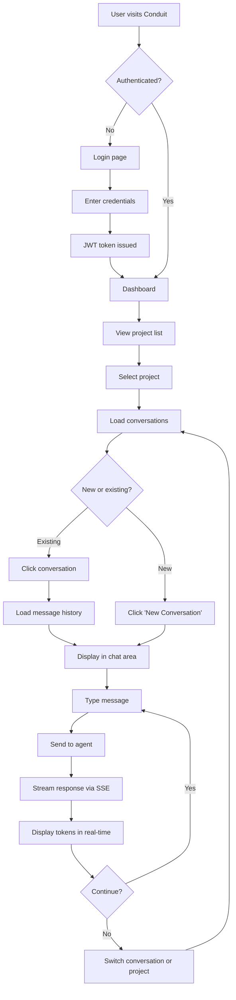
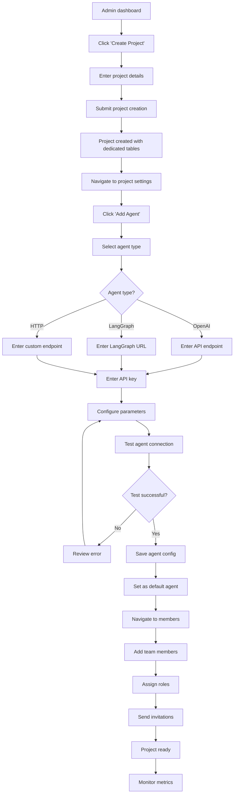
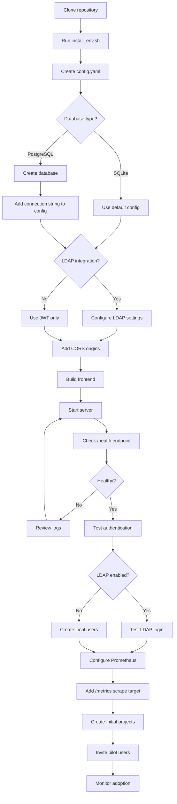
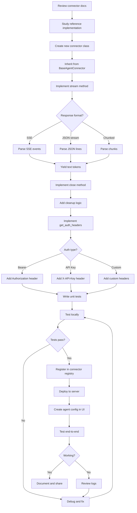
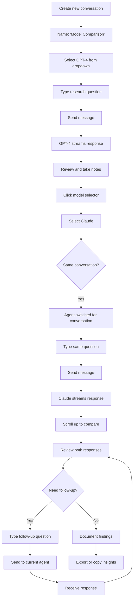
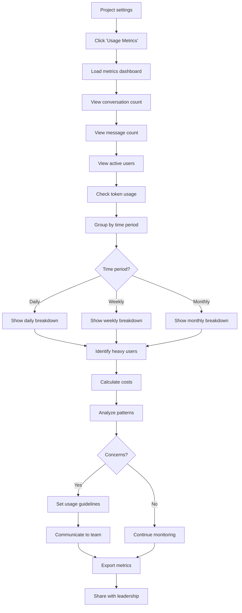

# User Journeys

## Overview

This document maps out the key user workflows in Conduit, showing step-by-step how each persona accomplishes their goals. Each journey includes a narrative description and a visual flow diagram.

---

## Journey 1: End User - Daily Chat Session

### Narrative

Sarah, a product manager, starts her day by checking in with the AI assistant for her product team's project. She needs to review yesterday's conversation about feature prioritization and ask follow-up questions.

### Steps

1. **Login**: Sarah navigates to Conduit and enters her credentials (or uses SSO via LDAP)
2. **Select Project**: She sees a list of projects she's a member of and clicks "Product Roadmap Q1"
3. **View Conversations**: The sidebar shows her recent conversations, including "Feature Prioritization Discussion"
4. **Resume Conversation**: She clicks the conversation to load the full message history
5. **Ask Follow-up**: She types a new question: "Based on our discussion, what should be the top 3 priorities?"
6. **Receive Response**: The AI streams a response in real-time, referencing the previous conversation context
7. **Continue or Switch**: She can continue the conversation or start a new one for a different topic

### Flow Diagram

### Success Criteria
- Login to response time < 5 seconds
- Conversation history loads < 1 second
- Streaming response starts < 2 seconds
- Zero data leakage between projects

---

## Journey 2: Project Admin - Project Setup

### Narrative

Alex, an engineering manager, needs to set up a new Conduit project for his team's AI-assisted code review workflow. He wants to configure a GPT-4 agent and invite his 5 team members.

### Steps

1. **Create Project**: Alex logs in and clicks "Create Project"
2. **Configure Details**: He enters project name "Code Review Assistant" and description
3. **Add Agent**: He navigates to agent settings and clicks "Add Agent"
4. **Configure Agent**: He selects "OpenAI" type, enters API endpoint and key, chooses "gpt-4" model
5. **Test Agent**: He sends a test message to verify the agent responds correctly
6. **Set as Default**: He marks this agent as the default for the project
7. **Invite Members**: He adds team members by username, assigning "member" role to developers and "admin" role to his tech lead
8. **Notify Team**: He shares the project name with his team via Slack
9. **Monitor Usage**: Over the next week, he checks the metrics to see adoption

### Flow Diagram

### Success Criteria
- Project creation time < 2 minutes
- Agent configuration time < 3 minutes
- Team member addition < 1 minute per member
- Zero configuration errors for valid credentials

---

## Journey 3: Platform Admin - Initial Deployment

### Narrative

Jordan, a DevOps engineer, needs to deploy Conduit for their organization. They want to integrate with the company's LDAP server, use PostgreSQL for production, and set up Prometheus monitoring.

### Steps

1. **Install Dependencies**: Jordan runs `sh scripts/install_env.sh` to set up the Python environment
2. **Configure Database**: They create a PostgreSQL database and update `config.yaml` with connection details
3. **Configure LDAP**: They add LDAP server settings to `config.yaml` for SSO integration
4. **Configure CORS**: They add the frontend domain to allowed CORS origins
5. **Build Frontend**: They run `sh scripts/build_fe.sh` to compile the Svelte frontend
6. **Start Server**: They run `sh scripts/run.sh` to start the FastAPI server
7. **Verify Health**: They check the `/health` endpoint to ensure the server is running
8. **Test LDAP**: They attempt to login with their LDAP credentials
9. **Set Up Monitoring**: They configure Prometheus to scrape the `/metrics` endpoint
10. **Create Initial Projects**: They create projects for pilot teams
11. **Monitor Adoption**: They track usage metrics over the first month

### Flow Diagram

### Success Criteria
- Deployment time < 30 minutes
- LDAP integration working on first try
- Prometheus metrics visible within 5 minutes
- Zero downtime during initial setup

---

## Journey 4: Developer - Custom Connector Implementation

### Narrative

Maya, a backend engineer, needs to integrate Conduit with her company's proprietary AI agent that runs on an internal API. She'll implement a custom HTTP connector.

### Steps

1. **Read Documentation**: Maya reviews the connector documentation in `src/conduit/core/agent/connectors/`
2. **Study Reference**: She examines `http_connector.py` as a reference implementation
3. **Implement Connector**: She creates a new connector class inheriting from `BaseAgentConnector`
4. **Implement stream()**: She implements the `stream()` method to call her internal API and yield response chunks
5. **Implement close()**: She adds cleanup logic for connection pooling
6. **Add Authentication**: She implements `get_auth_headers()` for her custom auth scheme
7. **Local Testing**: She tests the connector locally with a test script
8. **Register Connector**: She adds her connector to the connector registry
9. **Deploy**: She deploys the updated Conduit instance
10. **Configure in UI**: She creates an agent configuration using her new connector type
11. **End-to-End Test**: She sends a test message through the UI to verify the full flow

### Flow Diagram

### Success Criteria
- Connector implementation time < 4 hours
- Zero breaking changes to existing connectors
- Streaming works smoothly in UI
- Error handling covers all edge cases

---

## Journey 5: End User - Multi-Agent Comparison

### Narrative

Chris, a data scientist, wants to compare responses from GPT-4 and Claude for a research question. His project has both agents configured.

### Steps

1. **Start Conversation**: Chris creates a new conversation titled "Model Comparison - Research Question"
2. **Select GPT-4**: He uses the model selector dropdown to choose GPT-4
3. **Ask Question**: He types his research question about statistical methods
4. **Review Response**: He reads GPT-4's response and takes notes
5. **Switch to Claude**: He uses the model selector to switch to Claude (without leaving the conversation)
6. **Ask Same Question**: He types the same question again
7. **Compare Responses**: He reviews both responses side-by-side (scrolling up to see GPT-4's answer)
8. **Follow-up**: He asks a follow-up question to Claude based on its response
9. **Document Findings**: He copies key insights to his research notes

### Flow Diagram

### Success Criteria
- Agent switching time < 1 second
- Conversation context preserved across agent switches
- Clear visual indication of which agent provided each response
- No confusion about which agent is currently active

---

## Journey 6: Project Admin - Usage Monitoring

### Narrative

Taylor, a project owner, wants to understand how their team is using the AI assistant and identify any cost concerns.

### Steps

1. **Access Metrics**: Taylor navigates to the project settings and clicks "Usage Metrics"
2. **View Overview**: They see a dashboard with conversation count, message count, and active users
3. **Check Token Usage**: They review token consumption over the past week
4. **Identify Heavy Users**: They see which team members are sending the most messages
5. **Review Costs**: They calculate estimated costs based on token usage
6. **Analyze Patterns**: They notice usage spikes on certain days
7. **Adjust Limits**: If needed, they consider setting usage limits or guidelines
8. **Export Data**: They export metrics for reporting to leadership

### Flow Diagram

### Success Criteria
- Metrics load time < 2 seconds
- Data accuracy 100%
- Export format compatible with reporting tools
- Clear cost attribution per project

---

## Cross-Journey Patterns

### Common Success Factors
1. **Fast Response Times**: All interactions feel instant (< 2s)
2. **Clear Feedback**: Users always know what's happening (loading states, errors)
3. **Graceful Errors**: Failures are handled with helpful error messages
4. **Context Preservation**: State is maintained across navigation
5. **Intuitive Navigation**: Users can accomplish tasks without documentation

### Common Pain Points to Avoid
1. **Slow Loading**: Long waits for data or responses
2. **Confusing Permissions**: Unclear why actions are blocked
3. **Lost Context**: Losing work when switching views
4. **Hidden Features**: Important functionality buried in menus
5. **Unclear Errors**: Generic error messages without guidance

---

**Next**: [Architecture Overview](06-architecture.md) - Technical system design
