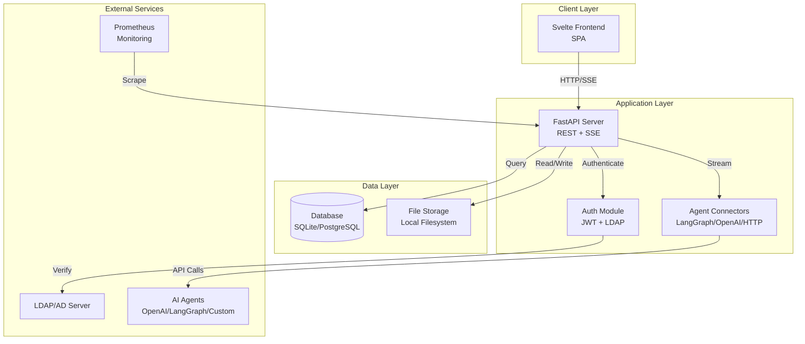
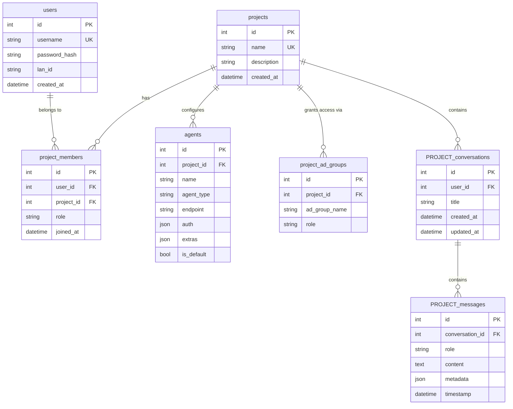
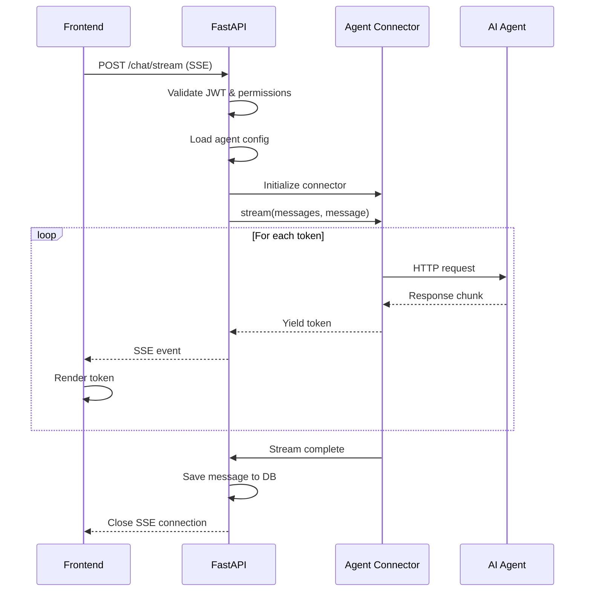
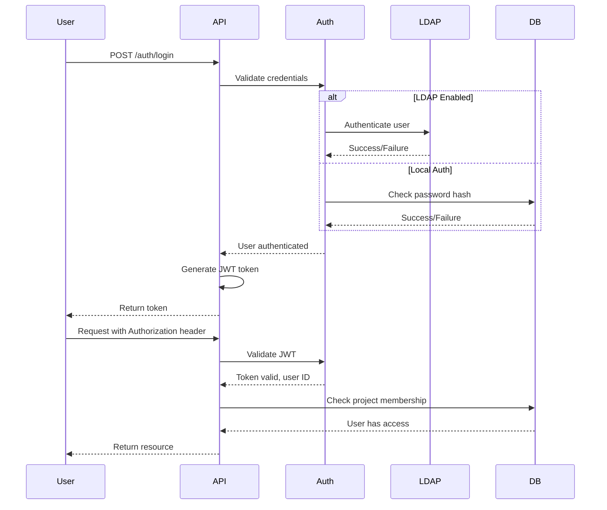
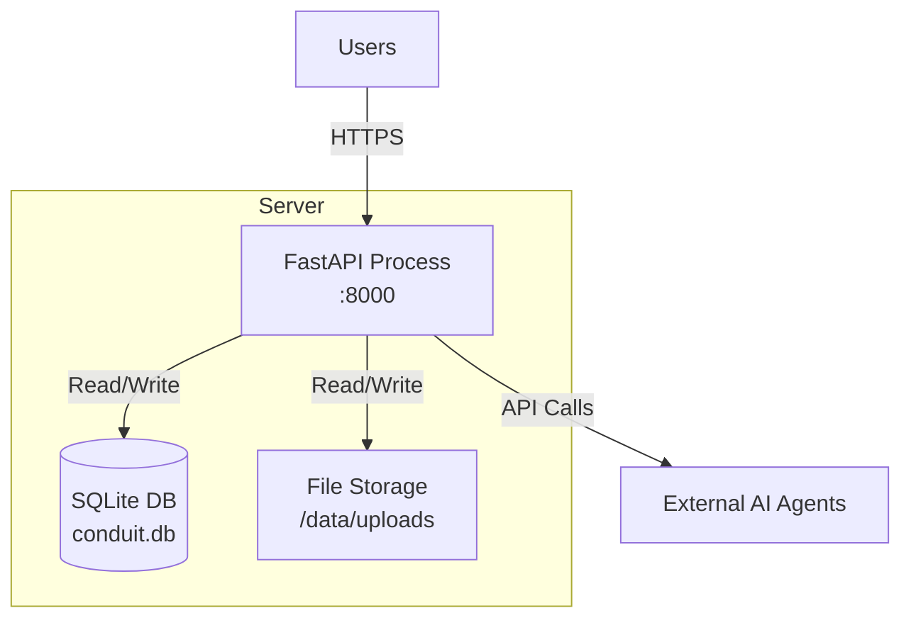
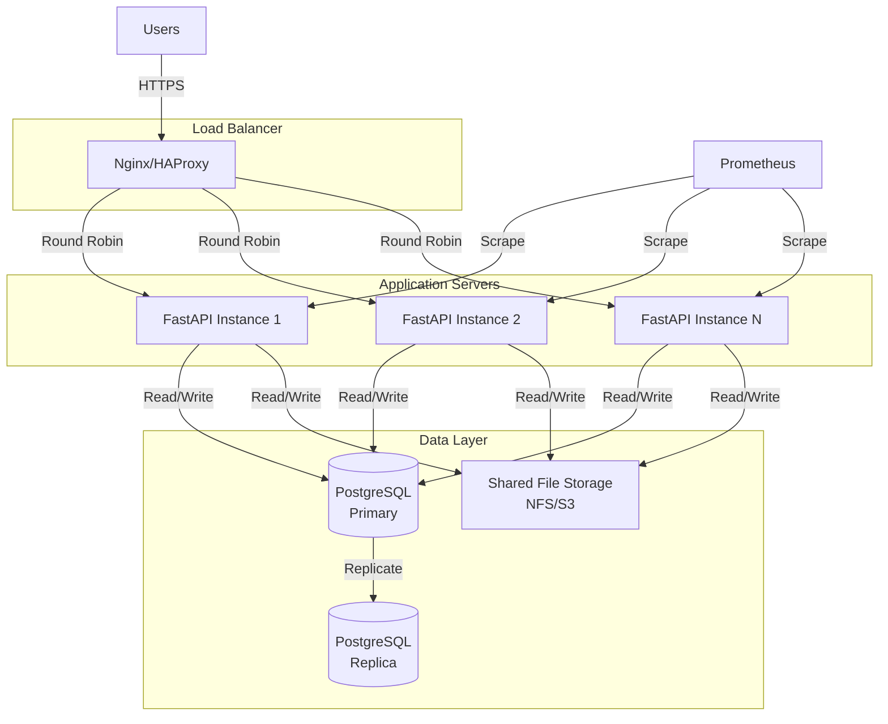
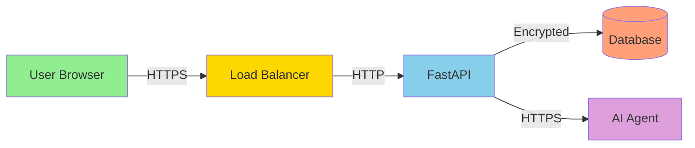

# Architecture Overview

## System Architecture

Conduit follows a modern three-tier architecture with clear separation between presentation, application, and data layers.

### High-Level Architecture Diagram



---

## Component Architecture

### Frontend (Svelte + Vite)

**Location**: `src/conduit/frontend/`

**Key Components**:
- `ChatArea.svelte` - Main chat interface with streaming support
- `Sidebar.svelte` - Project and conversation navigation
- `ProjectSettings.svelte` - Project configuration UI
- `ModelSelector.svelte` - Agent selection dropdown
- `DynamicPanel.svelte` - Dynamic UI rendering

**Build Process**:
1. Vite compiles Svelte components to optimized JavaScript
2. Output to `dist/` directory
3. FastAPI serves `dist/` as static files
4. SPA routing with fallback to `index.html`

**Communication**:
- REST API for CRUD operations
- Server-Sent Events (SSE) for streaming chat responses
- JWT tokens in Authorization headers

### Backend (FastAPI + SQLAlchemy)

**Location**: `src/conduit/`

**Entry Point**: `src/project.py` → `conduit.sdk.serve()`

**Core Modules**:

#### API Layer (`src/conduit/api/`)
- `main.py` - FastAPI app initialization, CORS, static file serving
- `routers/` - REST endpoint implementations
  - `auth.py` - Login, token management
  - `chat.py` - Streaming chat, message history
  - `projects.py` - Project CRUD
  - `agents.py` - Agent configuration
  - `conversations.py` - Conversation management
  - `rbac.py` - Membership and permissions
  - `metrics.py` - Usage statistics
  - `usage.py` - Token tracking

#### Core Logic (`src/conduit/core/`)
- `agent/` - Agent connector framework
  - `base_connector.py` - Abstract base class
  - `connectors/` - Implementations (LangGraph, OpenAI, HTTP)
- `db/` - Database models and operations
  - `models.py` - SQLAlchemy models
  - `db_chat.py` - Dynamic table creation
  - `database.py` - Connection management
- `auth/` - Authentication and authorization
  - `jwt.py` - Token generation/validation
  - `ldap.py` - LDAP integration
- `config.py` - Configuration loader

#### SDK (`src/conduit/sdk/`)
- `serve.py` - Server startup wrapper

---

## Data Architecture

### Database Schema Overview



### Dynamic Table Creation

**Key Innovation**: Each project gets its own conversation and message tables.

**Example**:
- Project name: "Product Roadmap Q1"
- Sanitized: "product_roadmap_q1"
- Tables created:
  - `product_roadmap_q1_conversation`
  - `product_roadmap_q1_messages`

**Benefits**:
- Complete data isolation at database level
- No cross-project queries possible
- Simplified permission checks
- Independent scaling per project

**Implementation**: `src/conduit/core/db/db_chat.py`

```python
def get_db(project_name: str):
    """Create project-specific tables if they don't exist"""
    sanitized = sanitize_project_name(project_name)
    # Create Conversation and Message models dynamically
    # Call create_all(checkfirst=True)
    return conversation_model, message_model
```

### Database Support

| Feature | SQLite | PostgreSQL | YugabyteDB |
|---------|--------|------------|------------|
| Development | ✅ Recommended | ✅ Supported | ✅ Supported |
| Production | ⚠️ Small scale | ✅ Recommended | ✅ Distributed |
| Concurrent Users | < 10 | 100+ | 1000+ |
| Replication | ❌ No | ✅ Yes | ✅ Yes |
| Horizontal Scaling | ❌ No | ⚠️ Limited | ✅ Yes |

---

## Agent Connector Architecture

### Connector Interface

All connectors implement `BaseAgentConnector`:

```python
class BaseAgentConnector(ABC):
    @abstractmethod
    async def stream(
        self,
        messages_history: List[Dict],
        message: str,
        conversation_id: str,
        files: List = None,
        metadata: Dict = None,
        **kwargs
    ) -> AsyncGenerator[str, None]:
        """Stream response tokens from agent"""
        pass

    @abstractmethod
    async def close(self):
        """Cleanup resources"""
        pass

    def get_auth_headers(self) -> Dict[str, str]:
        """Build authentication headers"""
        pass
```

### Connector Flow



### Connector Types

#### LangGraph Connector
- **Use Case**: Stateful, graph-based AI workflows
- **Features**: Thread management, custom state
- **Endpoint**: LangGraph server URL
- **Auth**: Bearer, Basic, or API key

#### OpenAI Connector
- **Use Case**: OpenAI or compatible APIs
- **Features**: Model selection, streaming completions
- **Endpoint**: OpenAI API or compatible
- **Auth**: API key (Bearer token)

#### HTTP Connector
- **Use Case**: Custom AI backends
- **Features**: Flexible request/response formats
- **Endpoint**: Any HTTP streaming endpoint
- **Auth**: Configurable (Bearer, Basic, API key, custom)

---

## Authentication & Authorization Flow

### JWT Authentication



### Permission Checks

**Hierarchy**:
1. **Authentication**: Valid JWT token
2. **Project Membership**: User is member of project
3. **Role Authorization**: User role permits action

**Example**:
```python
# User wants to delete a conversation
1. Validate JWT → Extract user_id
2. Check project_members → User in project?
3. Check role → Owner/Admin/Member?
4. Check ownership → User created conversation?
5. Allow if: (Owner/Admin) OR (Member AND owns conversation)
```

---

## Integration Points

### LDAP/Active Directory

**Configuration** (`config.yaml`):
```yaml
ldap:
  enabled: true
  server: ldap://ldap.example.com
  port: 389
  use_ssl: false
  search_base: "dc=example,dc=com"
  search_filter: "(uid={username})"
  bind_dn: "cn=admin,dc=example,dc=com"
  bind_password: "password"
```

**Flow**:
1. User submits username/password
2. If LDAP enabled, attempt LDAP bind
3. If LDAP succeeds, create/update local user record
4. Generate JWT token
5. If LDAP fails, fall back to local auth

### Prometheus Metrics

**Endpoint**: `GET /metrics`

**Exposed Metrics**:
- `conduit_conversations_total` - Total conversations created
- `conduit_messages_total` - Total messages sent
- `conduit_tokens_total` - Total tokens consumed
- `conduit_active_users` - Active users in time window
- `conduit_response_time_seconds` - API response times
- `conduit_errors_total` - Error counts by type

**Scrape Configuration**:
```yaml
scrape_configs:
  - job_name: 'conduit'
    static_configs:
      - targets: ['localhost:8000']
    metrics_path: '/metrics'
```

---

## Deployment Architecture

### Single-Server Deployment



**Use Case**: Development, small teams (< 50 users)

### Production Deployment



**Use Case**: Production, large teams (100+ users)

---

## Performance Considerations

### Streaming Response Optimization
- SSE connection pooling
- Async I/O for agent communication
- Token buffering for smooth rendering
- Connection timeout management

### Database Optimization
- Indexes on foreign keys and frequently queried columns
- Connection pooling via SQLAlchemy
- Prepared statements for common queries
- Project-specific tables reduce query complexity

### Caching Strategy
- JWT token validation caching
- Agent configuration caching
- Static file caching (frontend assets)
- Database connection pooling

### Scalability Limits

| Component | Bottleneck | Mitigation |
|-----------|------------|------------|
| Database | Concurrent writes | PostgreSQL, connection pooling |
| File Storage | Disk I/O | NFS, S3, CDN |
| Agent Calls | External API rate limits | Request queuing, backoff |
| SSE Connections | Server memory | Horizontal scaling, load balancing |

---

## Security Architecture

### Threat Model

**Protected Against**:
- ✅ Unauthorized access (JWT + RBAC)
- ✅ SQL injection (SQLAlchemy ORM)
- ✅ XSS (Frontend sanitization)
- ✅ CSRF (Token-based auth, no cookies)
- ✅ Data leakage between projects (Isolated tables)

**Considerations**:
- ⚠️ Rate limiting (not implemented)
- ⚠️ DDoS protection (external layer recommended)
- ⚠️ Audit logging (basic, not comprehensive)

### Data Flow Security



**Security Layers**:
1. **Transport**: HTTPS/TLS for all external communication
2. **Authentication**: JWT tokens with expiry
3. **Authorization**: Role-based access control
4. **Data**: Encrypted credentials in database
5. **Isolation**: Project-specific database tables

---

## Technical Stack Summary

| Layer | Technology | Purpose |
|-------|-----------|---------|
| **Frontend** | Svelte 4 | Reactive UI components |
| | Vite | Build tool and dev server |
| | TypeScript | Type-safe JavaScript |
| **Backend** | Python 3.11+ | Application runtime |
| | FastAPI | Web framework and API |
| | SQLAlchemy | ORM and database abstraction |
| | Pydantic | Data validation |
| **Database** | SQLite | Development database |
| | PostgreSQL | Production database |
| | YugabyteDB | Distributed database |
| **Auth** | JWT | Token-based authentication |
| | python-ldap | LDAP integration |
| **Monitoring** | Prometheus | Metrics collection |
| **Deployment** | Uvicorn | ASGI server |
| | Docker | Containerization (optional) |

---

**For detailed technical documentation, see**:
- [CLAUDE.md](../../CLAUDE.md) - Implementation guide
- [DATABASE_SCHEMA.md](../../DATABASE_SCHEMA.md) - Complete schema
- [Connector Documentation](../../src/conduit/core/agent/connectors/) - Agent integration

**Next**: [Success Metrics](07-success-metrics.md) - KPIs and measurement
