# Conduit User Journey Diagrams
## Visual Flowcharts for Presentations

This document contains Mermaid diagrams that can be rendered in presentations, documentation sites, or exported as images.

---

## Journey 1: End User - Daily Chat Experience

### Complete Flow Diagram

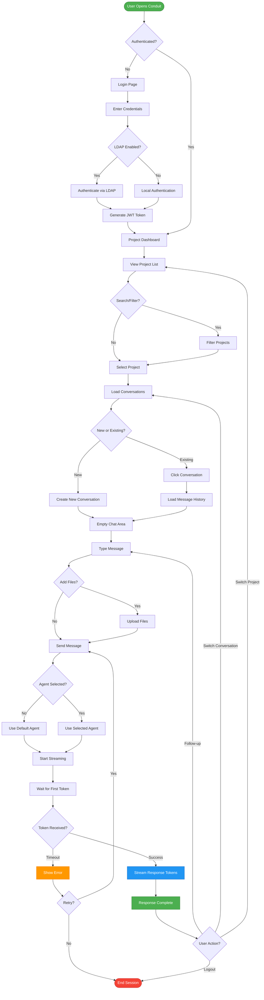

### Emotional Journey Timeline

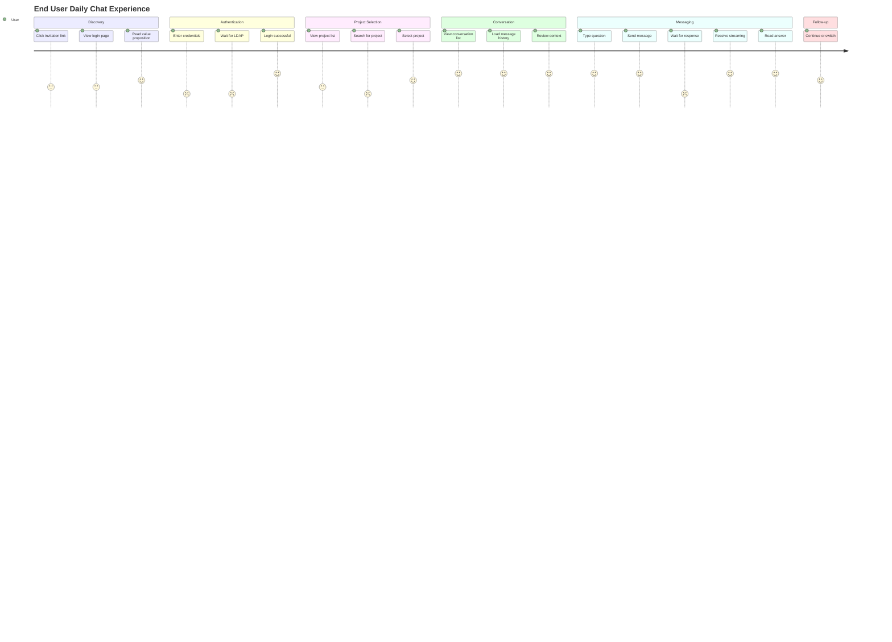

### Pain Points Heatmap

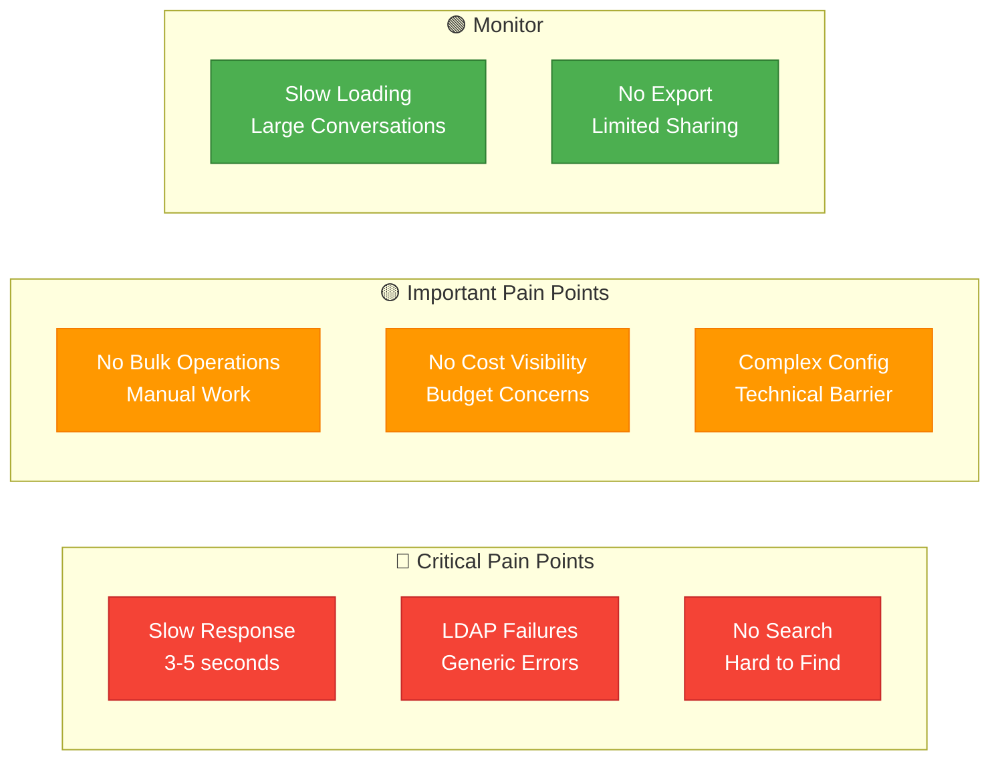

---

## Journey 2: Project Admin - Setup & Configuration

### Project Setup Flow

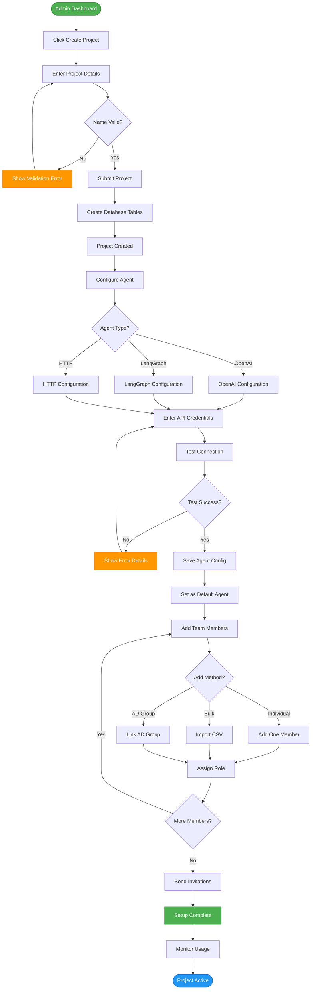

### Time Investment Breakdown

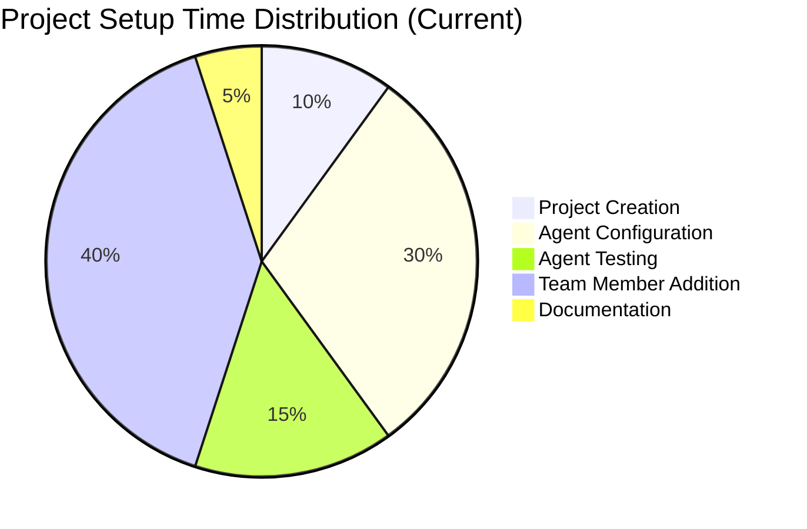

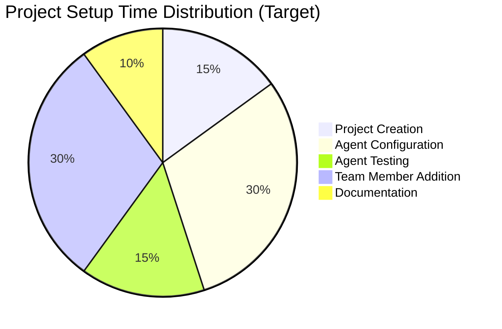

### Admin Journey Emotional Arc

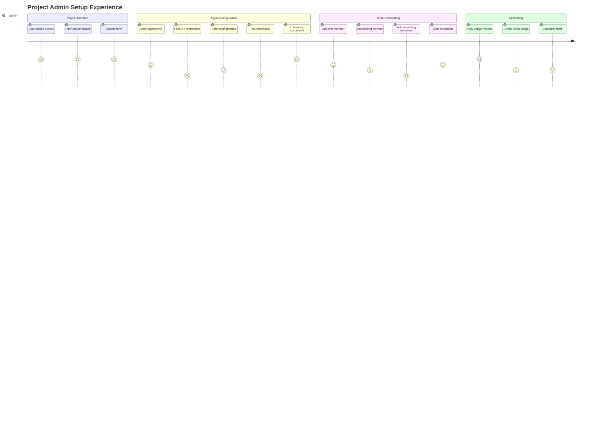

---

## Journey 3: Platform Admin - Deployment

### Deployment Flow

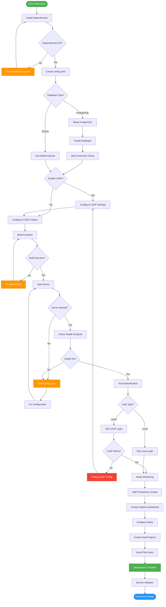

### Deployment Success Funnel

```mermaid
graph LR
    A[100 Attempts] -->|90%| B[90 Installed]
    B -->|67%| C[60 Configured]
    C -->|75%| D[45 LDAP Working]
    D -->|94%| E[42 Monitoring Setup]
    E -->|100%| F[42 Production Ready]

    style A fill:#2196F3,stroke:#1565C0,color:#fff
    style B fill:#4CAF50,stroke:#2E7D32,color:#fff
    style C fill:#FF9800,stroke:#F57C00,color:#fff
    style D fill:#F44336,stroke:#C62828,color:#fff
    style E fill:#4CAF50,stroke:#2E7D32,color:#fff
    style F fill:#4CAF50,stroke:#2E7D32,color:#fff
```

---

## Cross-Journey Insights

### Pain Point Impact Matrix

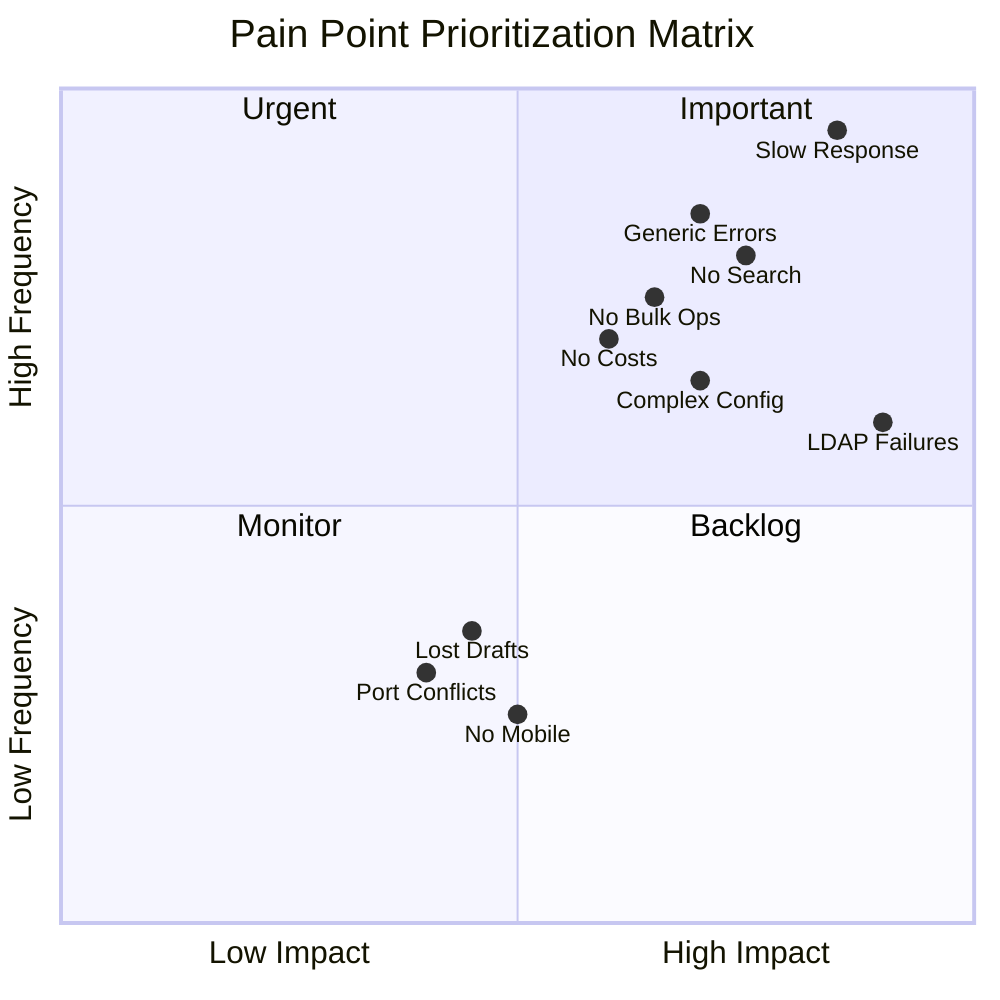

### Opportunity Roadmap Timeline

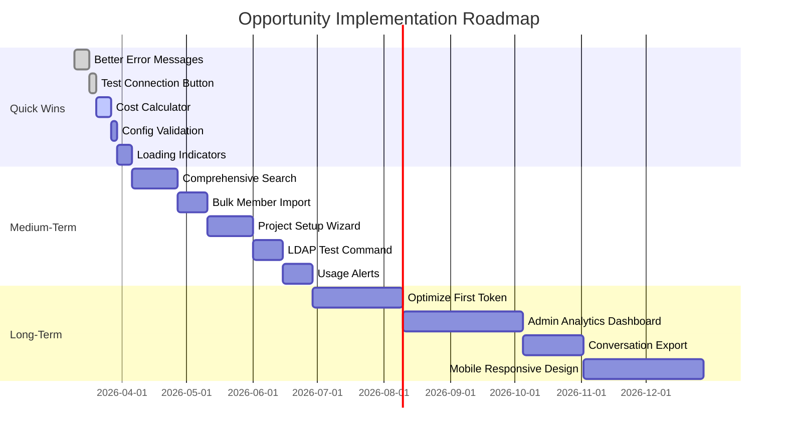

### User Satisfaction Trend (Projected)

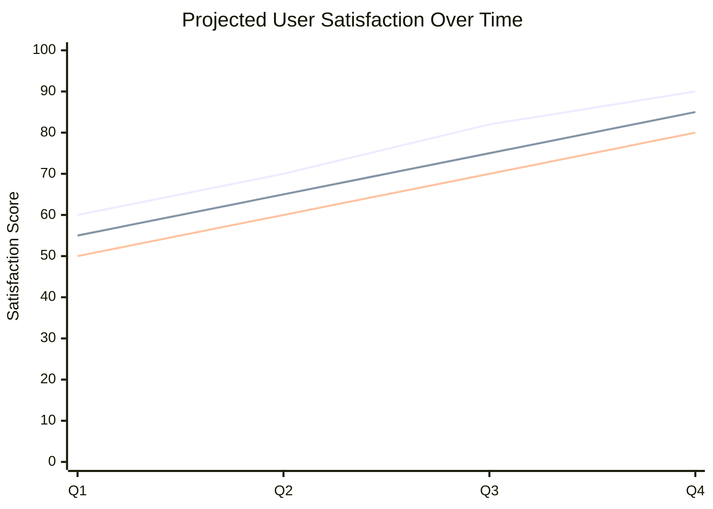

---

## Metrics Dashboard Visualizations

### Current vs Target Performance

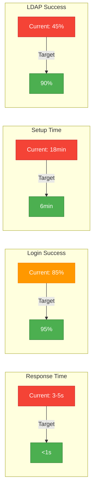

### Feature Adoption Funnel

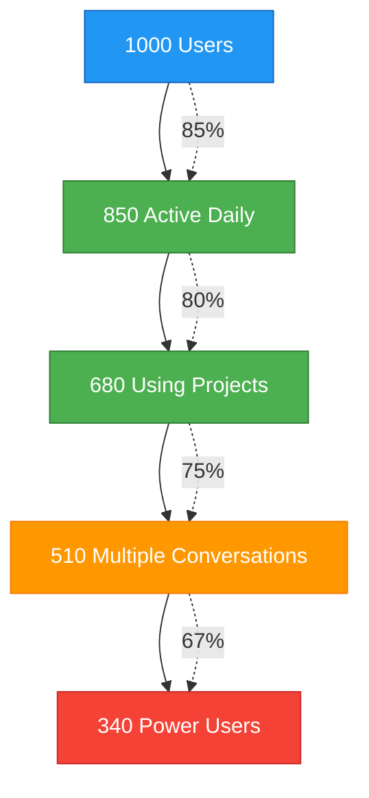

---

## How to Use These Diagrams

### In Presentations

1. **Copy the Mermaid code** from this document
2. **Paste into presentation tools** that support Mermaid:
   - Marp (Markdown Presentations)
   - Slidev
   - reveal.js with Mermaid plugin
   - Google Slides (via Mermaid extension)

### Export as Images

1. **Use Mermaid Live Editor**: https://mermaid.live/
2. **Paste diagram code** and export as PNG/SVG
3. **Insert images** into PowerPoint, Keynote, or Google Slides

### In Documentation

1. **GitHub/GitLab**: Automatically renders Mermaid in Markdown
2. **Confluence**: Use Mermaid macro
3. **Notion**: Use Mermaid embed block

### Customization

- **Colors**: Modify `style` statements to match brand colors
- **Layout**: Adjust `graph TB` (top-bottom) to `LR` (left-right)
- **Details**: Add/remove nodes based on audience technical level

---

**Document Version**: 1.0
**Last Updated**: March 2026
**Mermaid Version**: 10.x compatible
